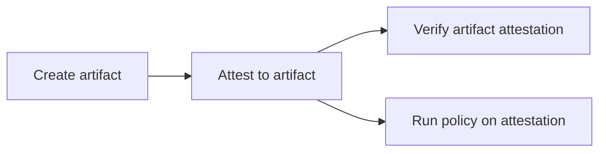
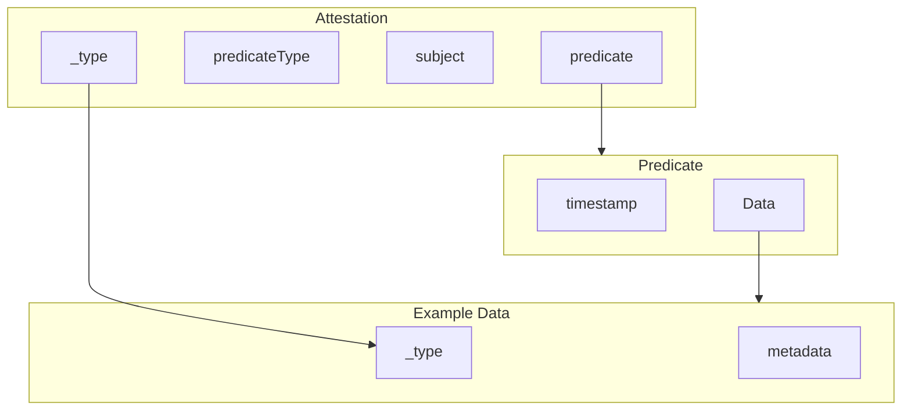

# Contributing to AutoGov Reusable Workflows

## Context

### In a no trust workflow

Developers must not influence the commands used to create artifacts or their attestations if the artifacts' integrity and contents are to be trusted as this helps address [SLSA level 3's focus](https://slsa.dev/spec/v1.0/levels) on preventing tampering during the build or artifact creation.

### Life of an artifact in an autogov pipeline



> how the artifacts/attestations are passed from job to job or retrieved job to job is the difference of the high permission vs low permissions reusable workflows

## Directions

Currently all artifact creation and attestation definitions are in the `rw-*-attest-*.yaml` file(s).

To add a new artifact creation and attestation you will add the following to the `rw-*-attest-*.yaml` file(s).

1. Create a job that will
     - create the artifact
       - hard code the command that will generate the artifact
     - create an attestation for the artifact
       - if using the generic/custom attest, you will likely need to define a custom predicate (*dedicate a job step to defined the predicate and see the predicate guide at bottom of doc*)
       - use the [attest action provided by GitHub](https://github.com/actions/attest)
         - provide the predicate (type & path)
         - provide the subject (name & digest)
     - upload the attestation
       - rename & move the artifact into the attestations folder
       - upload the artifact at the new path

        > if you are creating a language specific artifact, it might be necessary to have a dynamic job definition based on user input. Note, the user should not be able to control the command executed, but maybe they set an input or environment variable for language. The reusable workflow can have a library of language commands to generate the desired artifact (just start with one language, build tool, test tool, etc)

1. Update the outputs of the workflow_call
   - add new artifact attestation to outputs of `rw-*-attest-*.yaml` : `attest-<new-artifact>-attestations-artifact-id`

1. Create a policy for this artifact's attestation in the [Demo policy library](https://github.com/liatrio/demo-gh-autogov-policy-library)
   - this step can be started before or after the merge of new attestation artifact creation job  *(it might be helpful to start writing the policy to help determine what information you need in the attestation as determined by the new predicate)*
   - it's important to take action on the attestations, or else they are just noise

## Explanation of Predicate

A predicate is a statement or assertion about an artifact. In the context of attestations, it provides metadata about the artifact, such as its origin, integrity, and other relevant information. The predicate helps verify the authenticity and integrity of the artifact, ensuring that it has not been tampered with and is from a trusted source.

The predicate can also define metadata from the artifact that we intend to check via policy execution.

You can browse through the existing predicates [here](https://github.com/in-toto/attestation/blob/main/spec/predicates/README.md).

You can create a custom predicate. Use the [predicate guidelines](https://github.com/in-toto/attestation/blob/main/docs/new_predicate_guidelines.md#predicate-conventions) when creating a custom predicate.

## Custom/Generic Predicate

You should review and use the [Cosign Generic Predicate Specification](https://github.com/sigstore/cosign/blob/main/specs/COSIGN_PREDICATE_SPEC.md#cosign-generic-predicate-specification) when authoring your predicate.



1. Set the `predicate`.`Data` and `_type` by creating a json file with the desired data. ( ℹ️ the path and file name of this json will be used for the `predicate-path` action field/argument later on)

    `example.json`

    ```json
    {
        "_type": "https://in-toto.io/Statement/v0.1",
        "metadata": {
            "workflowData": {
            "workflowRefPath": "${{ github.workflow_ref }}",
            "branch": "${{ github.ref_name }}",
            "buildWorkflowRunId": "${{ github.run_id }}",
            "event": "${{ github.event_name }}",
            "inputs": "${{toJson(inputs)}}"
            },
            "commitData": {
            "commitSHA": "${{ github.sha }}",
            "commitTimestamp": "${{ github.event.head_commit.timestamp }}"
            },
            "repositoryData": {
            "repository": "${{ github.repository }}",
            "repositoryId": "${{ github.repository_id }}",
            "githubServerURL": "${{ github.server_url }}"
            },
            "ownerData": {
            "owner": "${{ github.repository_owner }}",
            "ownerId": "${{ github.repository_owner_id }}"
            },
            "jobData": {
            "jobId": "${{ github.job }}",
            "runNumber": "${{ github.run_number }}",
            "action": "${{ github.action }}",
            "actor": "${{ github.actor }}",
            "status": "${{ job.status }}"
            },
            "runnerData": {
            "os": "${{ runner.os }}",
            "name": "${{ runner.name }}",
            "arch": "${{ runner.arch }}",
            "environment": "${{ runner.environment }}"
            }
        }
    }
    ```

    > You will likely need to dynamically pull information from current state of the pipeline job and/or artifacts created in this job for that predicate data.

2. Add a step that uses the [actions/attest](https://github.com/actions/attest) action. This action will take a predicate and subject and create an attestation.

    ```yaml
    - name: Attest Example Data
        uses: actions/attest@67422f5511b7ff725f4dbd6fb9bd2cd925c65a8d # v1.4.1
        id: attest-example-data
    ```

3. Set  `predicateType` and `subject` by supplying them as arguments to the action [actions/attest](https://github.com/actions/attest). All the arguments/fields supplied to the action should look something like the following.

    ```yaml
    - name: Attest Example Data
        uses: actions/attest@67422f5511b7ff725f4dbd6fb9bd2cd925c65a8d # v1.4.1
        id: attest-example-data
        subject-name: ${{ inputs['subject-name'] }} # or manually set name
        subject-path: '<PATH TO ARTIFACT>' # build artifact we are associating the attestation to. If image, use `subject-digest` instead
        predicate-type: '<PREDICATE URI>' # example: 'https://cosign.sigstore.dev/attestation/v1'
        predicate-path: '<PATH TO PREDICATE>' # example.json
        push-to-registry: true
    ```

This job should now create an attestation with custom data per your predicate definition.

---

By following these guidelines, you can successfully add predicate(s) to attest to artifacts using the [attest GitHub Action](https://github.com/actions/attest). Thank you for contributing to AutoGov!
