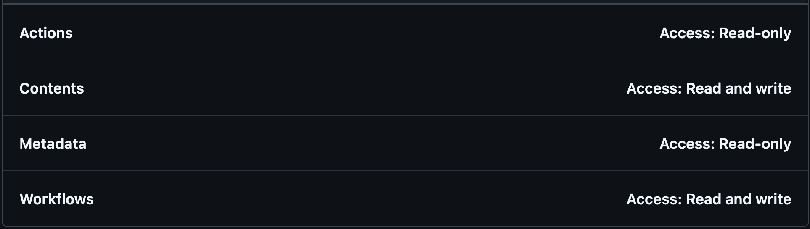

# Reusable Workflows using GitHub Artifact Attestations

- [Quick Start Guide](#quick-start-guide)
- [Paving the Path](#paving-the-path)
- [Achieving SLSA Build Levels Using Reusable Workflows](#achieving-slsa-build-levels-using-reusable-workflows)
  - [L3: Isolation of Build from Attest](#l3-isolation-of-build-from-attest)
  - [L2: Ensure a Trusted Build Environment](#l2-ensure-a-trusted-build-environment)
  - [L1: Documented Build Parameters](#l1-documented-build-parameters)
- [Usage](#usage)
  - [GitHub Artifact Attestation Actions and Other Tools Used](#github-artifact-attestation-actions-and-other-tools-used)
  - [Repository Access](#repository-access)
  - [Inputs](#inputs)
  - [Outputs](#outputs)
  - [Example Workflow Snippets](#example-workflow-snippets)
- [Troubleshooting](#troubleshooting)
- [Additional Resources/Documentation](#additional-resourcesdocumentation)

## Quick Start Guide

1. **Configure Repositories for Access**:
   Ensure you have the necessary permissions and tokens configured in your remote caller repository described in the [Repository Access](#repository-access) section in [the Secrets and Variables section for Actions](https://docs.github.com/en/actions/security-for-github-actions/security-guides/using-secrets-in-github-actions).
   - **Permissions**: Ensure you have the necessary permissions to run the workflows.
   - **Tokens**: Set up the required tokens as described in the [Repository Access](#repository-access) section.
2. **Create Your Local Composite Actions**:
   For example create `.github/actions/build-image/action.yaml` for images or `.github/actions/build-blob/action.yaml` for blobs:

**`build-image`Composite Action**

```yaml
inputs:
    subject-name:
        description: The name for the image.
        required: true
        default: ghcr.io/${{ github.repository }}
    build-context:
        description:
            Build's context is the set of files located in the specified PATH (the default Git context
            URL will not work since a repo checkout is needed to invoke the composite action / isolated build steps).
            A valid Dockerfile must be available in the PATH given.
        required: false
        default: .
    docker-file:
        description: Path to the Dockerfile. (default is {context}/Dockerfile).
        required: false
    platforms:
        description: List of target platforms for build.
        required: false
        default: linux/amd64,linux/arm64
    registry:
        description: Container registry to push image.
        required: false
        default: ghcr.io
outputs:
    image-digest:
        description: The image digest of the image that was built from the build-image job.
        value: ${{ steps.build-image.outputs.digest }}
    image-build-metadata:
        description: A JSON object with the build-image job's result metadata.
        value: ${{ steps.build-image.outputs.metadata }}

runs:
    using: composite
    steps:
        - name: Image Metadata
          id: meta
          uses: docker/metadata-action@8e5442c4ef9f78752691e2d8f8d19755c6f78e81 # v5.5.1
          with:
              images: ${{ inputs.subject-name }}
              tags: |
                  type=ref,event=branch
                  type=ref,event=pr
                  type=sha
                  type=raw,value=latest,enable=${{ github.event_name == 'release' }}
                  type=raw,value=${{ github.event.release.tag_name }},enable=${{ github.event_name == 'release' }}
        - name: Set up QEMU
          uses: docker/setup-qemu-action@49b3bc8e6bdd4a60e6116a5414239cba5943d3cf # v3.2.0
        - name: Set up Docker Buildx
          uses: docker/setup-buildx-action@988b5a0280414f521da01fcc63a27aeeb4b104db # v3.6.1
        - name: Log in to GitHub Container Registry
          uses: docker/login-action@9780b0c442fbb1117ed29e0efdff1e18412f7567 # v3.3.0
          with:
              registry: ${{ inputs.registry }}
              username: ${{ github.actor }}
              password: ${{ github.token }}
        - name: Build and push Docker image
          uses: docker/build-push-action@32945a339266b759abcbdc89316275140b0fc960 # v6.8.0
          id: build-image
          with:
              context: ${{ inputs.build-context }}
              file: ${{ inputs.docker-file }}
              push: true
              platforms: ${{ inputs.platforms }}
              tags: ${{ steps.meta.outputs.tags }}
              labels: ${{ steps.meta.outputs.labels }}
              outputs: type=oci,dest=/tmp/image.tar
              cache-from: type=gha
              cache-to: type=gha,mode=max
```

**`build-blob`Composite Action**

```yaml
runs:
    using: composite
    steps:
        - name: Build Blob
          shell: bash
          run: |
              echo "i am a blob being created at $(date +'%Y-%m-%d %H:%M:%S') by ${{ github.triggering_actor }} by rw of
              ${{ github.workflow_ref }} in the repo of ${{ github.repository }} by the action known as ${{ github.action }}
              which may or may not live in the same repo as the action repo of ${{ github.action_repository || 'nothing to see here' }}." > i_am_blob && ls -alth  &&
              echo "$(date +'%Y-%m-%d %H:%M:%S') by ${{ github.triggering_actor }} by rw of
              ${{ github.workflow_ref }} in the repo of ${{ github.repository }}" > i_am_another_blob
```

3. **Create Your Caller Workflows / Configure Inputs**:
   For example create `.github/workflows/cw-build-image.yaml` for images or `.github/workflows/cw-build-blob.yaml` for blobs:

**`cw-build-image.yaml`**:

### Calling Reuseable Workflow to Build Image

```yaml
name: Build Image Caller Workflow

on:
    workflow_dispatch:
    push:

jobs:
    attest-image: #image
      permissions:
        id-token: write
        attestations: write
        packages: write
        contents: write
        actions: read
      uses: liatrio/demo-gh-autogov-workflows/.github/workflows/rw-attest.yaml@main # The ref here is meant for a quick getting started path; branches/tags can also be used, but a commit SHA from an official release is recommended.
      with:
        build-type: image
        subject-name: ghcr.io/${{ github.repository }}
    verify-image: #image
      permissions:
        id-token: write
        attestations: read
        packages: read
      needs: [attest-image]
      uses: liatrio/demo-gh-autogov-workflows/.github/workflows/rw-verify.yaml@main # The ref here is meant for a quick getting started path; branches/tags can also be used, but a commit SHA from an official release is recommended.
      secrets: inherit
      with:
        build-type: image
        image-digest: ${{ needs.attest-image.outputs.image-digest }}
        cert-identity: https://github.com/liatrio/demo-gh-autogov-workflows/.github/workflows/rw-attest.yaml@refs/heads/main # Include the "full" branch, tag or commit SHA reference such as `refs/heads/main` for the main branch.
    run-opa-image: #image
        permissions:
            attestations: read
            id-token: write
            packages: read
        needs: [verify-image, attest-image]
        uses: liatrio/demo-gh-autogov-workflows/.github/workflows/rw-run-opa.yaml@main # The ref here is meant for a quick getting started path; branches/tags can also be used, but a commit SHA from an official release is recommended.
        secrets: inherit
        with:
            build-type: image
            image-digest: ${{ needs.attest-image.outputs.image-digest }}
```

### Calling Reuseable Workflow to Build Blob(s)

**`cw-build-blob.yaml`**:

```yaml
name: Build Blob Caller Workflow

on:
    workflow_dispatch:
    push:

permissions: {}

jobs:
    attest-blob: #blob
        permissions:
            id-token: write
            attestations: write
            packages: write
            contents: write
            actions: read
        uses: liatrio/demo-gh-autogov-workflows/.github/workflows/rw-attest.yaml@main # The ref here is meant for a quick getting started path; branches/tags can also be used, but a commit SHA from an official release is recommended.
        with:
            build-type: blob
            subject-path: |
                i_am_blob
                i_am_another_blob
    verify-blob: #blob
        permissions:
            id-token: write
            attestations: read
            packages: read
        needs: [attest-blob]
        uses: liatrio/demo-gh-autogov-workflows/.github/workflows/rw-verify.yaml@main # The ref here is meant for a quick getting started path; branches/tags can also be used, but a commit SHA from an official release is recommended.
        secrets: inherit
        with:
            build-type: blob
            build-artifact-id: ${{ needs.attest-blob.outputs.build-artifact-id }}
            cert-identity: https://github.com/liatrio/demo-gh-autogov-workflows/.github/workflows/rw-attest.yaml@refs/heads/main # Include the "full" branch, tag or commit SHA reference such as `refs/heads/main` for the main branch.
    run-opa-blob: #blob
        permissions:
            attestations: read
            id-token: write
            packages: write
        needs: [verify-blob, attest-blob]
        uses: liatrio/demo-gh-autogov-workflows/.github/workflows/rw-run-opa.yaml@main # The ref here is meant for a quick getting started path; branches/tags can also be used, but a commit SHA from an official release is recommended.
        secrets: inherit
        with:
            build-type: blob
            all-attestations-artifact-id: ${{ needs.attest-blob.outputs.all-attestations-artifact-id }}
```

4. **Run the Workflow**:
   Trigger the workflow using one of the supported event types:

    - [`push`] / [creation or update of a git tag or branch](https://docs.github.com/en/actions/using-workflows/events-that-trigger-workflows#create).
    - [`release`] / [creation or update of a GitHub release](https://docs.github.com/en/actions/using-workflows/events-that-trigger-workflows#release).
    - [`create`] / [creation of a git tag or branch](https://docs.github.com/en/actions/using-workflows/events-that-trigger-workflows#push).
    - [`workflow_dispatch`] / [enables the ability to trigger workflow manually](https://docs.github.com/en/actions/using-workflows/events-that-trigger-workflows#workflow_dispatch).

5. **Check Results**:
   Review the results and logs to ensure everything is working as expected.


## Why Sign/Attest?

In today's digital landscape, ensuring the integrity and security of software development processes is crucial. GitHub's official Action for creating signed SLSA (Supply Chain Levels for Software Artifacts) attestations, along with its [CLI tool for verifying artifacts](https://cli.github.com/manual/gh_attestation), provides a robust foundation for securing the distribution of built artifacts.

To achieve [SLSA Build Level 3](https://slsa.dev/spec/v1.0/levels#build-l3), which mitigates risks such as:

- Running builds on self-hosted runners
- Unapproved code changes
- Exposed credentials associated with attestation signing material
- [Hard-to-follow build steps](https://slsa.dev/spec/v1.0/provenance#BuildDefinition)

GitHub recommends using [Reusable Workflows](https://github.com/slsa-framework/github-actions-buildtypes/tree/main/workflow/v1).

This README outlines how our services can help your organization implement a Reusable Workflow to meet SLSA Build Level 3 requirements, ensuring a secure and compliant Software Development Life Cycle (SDLC).

By implementing this reusable workflow, your organization can achieve SLSA Build Level 3 compliance, ensuring a secure and verifiable software development process. Our team is ready to assist you in integrating these automated governance technologies into your SDLC, enhancing the security and integrity of your software artifacts.

### The SLSA Build Track

There are a variety of necessary checkboxes ✅ required to achieve different SLSA Build Levels on the SLSA [build track](https://slsa.dev/spec/v1.0/levels#build-track), which sets expectations for achieving each Build Level without assumptions.

For build provenance attestation, "the lowest level only requires the provenance to exist, while higher levels provide increasing protection against tampering of the build, the provenance, or the artifact." It is specifically through the verification process that it is confirmed that they were "built as expected," preventing a variety of [supply chain threats](https://slsa.dev/spec/v1.0/threats).

## Sigstore

Sigstore is an open-source project that aims to improve the security of the software supply chain by providing a set of tools for signing, verifying, and storing software artifacts. It includes several key components:

- **Rekor**: A transparency log that records signed metadata, providing an immutable and publicly auditable record of software artifacts and their provenance. This helps ensure that the artifacts have not been tampered with and can be traced back to their source. For more details, visit the [Rekor GitHub repository](https://github.com/sigstore/rekor).
- **Fulcio**: A certificate authority that issues short-lived certificates based on OpenID Connect (OIDC) identities. This allows for "keyless" signing, where the private key is ephemeral and never leaves the memory of the signing process. For more details, visit the [Fulcio GitHub repository](https://github.com/sigstore/fulcio).
- **Cosign**: A tool for signing and verifying container images and other artifacts. It integrates with Fulcio and Rekor to provide a seamless signing and verification experience. For more details, visit the [Cosign GitHub repository](https://github.com/sigstore/cosign).

GitHub's artifact attestation feature leverages Sigstore using GitHub's own private Sigstore instance (e.g. private repositories use their private instance and public repositories utilize Sigstore's public good instance) to create a verifiable link between software artifacts and their source code and build instructions. By using GitHub Actions, developers can easily generate and verify signed attestations, ensuring the integrity and security of their software supply chain.

For more details, you can refer to the [GitHub blog post](https://github.blog/news-insights/product-news/introducing-artifact-attestations-now-in-public-beta/) and the [Sigstore blog](https://blog.sigstore.dev/cosign-verify-bundles/). Additionally, the [Cosign GitHub repository](https://github.com/sigstore/cosign) provides comprehensive documentation and examples.

### Paving the Path

To achieve SLSA Build Level 3, we recommend using GitHub-native tools and reusable workflows. Our approach is inspired by the slsa-framework's implementations, specifically [slsa-github-generator](https://github.com/slsa-framework/slsa-github-generator/blob/main/BYOB.md#build-your-own-builder-byob-framework) and [slsa-verifier](https://github.com/slsa-framework/slsa-verifier), and provides a model for securing your software development process.

["The only way to interact with a reusable workflow is through the input parameters it exposes to the calling workflow."](https://github.com/slsa-framework/slsa-github-generator/blob/3d34abbe34b268bb6c02651df2117370e8cee1bd/SPECIFICATIONS.md#interference-between-jobs)

```shell
                    ┌──────────────────────┐         ┌───────────────────────────────┐
                    │                      │         │                               │
                    │  Source Repository   │         │       Trusted Builder         │
                    │  -----------------   │         │     (Reusable Workflow)       │
                    │                      │         │     -------------------       │
                    │                      │         │                               │
                    │ .caller-workflow.yaml│         │                               │
                    │                      ├─────────┼─────────────┐                 │
                    │                      │         │             │                 │
                    │                      │         │   ┌─────────▼────────────┐    │
                    │   User Workflow      │         │   │     Build            │    │
                    │                      │         │   └──────────────────────┘    │
                    └──────────────────────┘         │             │                 │
                                                     │   ┌─────────▼────────────┐    │
                                                     │   │  Generate Provenance │    │
                                                     │   └─────────┬────────────┘    │
                                                     │             │                 │
                                                     └─────────────┼─────────────────┘
                                                                   │
                                                                   │
                                                     ┌─────────────▼─────────────────┐
                                                     │                               │
                                                     │   Binary    Signed Provenance │
                                                     │                               │
                                                     │                               │
                                                     │         Artifacts             │
                                                     │         ---------             │
                                                     └───────────────────────────────┘
```

This diagram illustrates the process of using a reusable workflow to achieve SLSA Build Level 3. The source repository contains the caller workflow, which interacts with the trusted builder (reusable workflow) to build the artifacts and generate signed provenance. The artifacts and their signed provenance are then securely stored and can be verified to ensure their integrity.

## Achieving SLSA Build Levels Using Reusable Workflows

### Verification

Often the focus is put upon the "signing" of an artifact to attest to its integrity, but the source of value lies within [verifying artifacts](https://slsa.dev/spec/v1.0/verifying-artifacts). GitHub offers the ability to download and verify attestations using the [GitHub Attestation Command](https://cli.github.com/manual/gh_attestation).

The `gh attestation verify` command requires the path to a local or [OCI](https://opencontainers.org/) artifact as well as an expected source `--owner` or `--repo`. By default, the CLI does not check the `--signer-workflow` or its equivalent: `--cert-identity`.

Considering many organizations and/or developers run builds and workflows from non-official branches, we impose additional requirements for the verifier to ensure that both the source repository and signer workflow are from approved branches or tags (e.g. commit hash). Verifying the signing workflow's branch ensures that the artifact was built to meet SLSA Level 3 requirements.

**Note**: Currently, gh-cli does not support verification via the source branch directly. To address this, we use a combination of the `--jq` option and `grep` to perform this check.

```yaml
- name: Verify Image Attestation(s)
  if: ${{ inputs.build-type == 'image' }}
  run: |
      set +x
      gh attestation verify \
        oci://${{ inputs.subject-name }}@${{ inputs.image-digest }} \
        --repo ${{ github.repository }} \
        --deny-self-hosted-runners \
        --cert-identity \
        "${{ inputs.cert-identity }}" \
        --format json \
        --jq '.[].verificationResult.signature.certificate.sourceRepositoryRef' \
        | grep "^${{ github.ref }}$"
- name: Verify Blob Attestation(s)
  if: ${{ inputs.build-type == 'blob' }}
  env:
      ARTIFACTS_FOLDER: ./artifacts
  run: |
      for FILE in "$ARTIFACTS_FOLDER"/*; do
        gh attestation verify \
          $FILE \
          --deny-self-hosted-runners \
          --repo ${{ github.repository }} \
          --cert-identity "${{ inputs.cert-identity }}" \
          --format json --jq '.[].verificationResult.signature.certificate.sourceRepositoryRef' \
        | grep "^${{ github.ref }}$"
      done
```

Again, verifying via the Reusable Workflow's GitHub reference (e.g. commit SHA, branch, tag etc) helps to thwart source repositories and/or signer workflows from being used that are not using approved branches, tags, or commit SHAs:

```yaml
cert-identity:
    description: >
        The --cert-identity of the signer workflow, or builder, used in the verify job ensuring artifacts and attestations can be verified with the gh-cli.
    default: https://github.com/liatrio/demo-gh-autogov-workflows/.github/workflows/rw-attest.yaml@refs/heads/main
```

Our approach guarantees that both the source repository and the signer workflow originate from approved branches or tags, providing confidence that the artifact was built to meet SLSA Level 3 requirements as long as whomever is verifying is diligent and remembers to include the `cert-identity` (e.g. also known as `signer-workflow`) flag via the gh-cli.

It is also possible to use Sigstore's own [cosign](https://github.com/sigstore/cosign) to [verify bundles](https://blog.sigstore.dev/cosign-verify-bundles/) though this is [currently not documented](https://github.com/actions/attest-build-provenance/issues/162) particularly well since GitHub's Artifact Attestations offering is [still in beta](https://github.blog/news-insights/product-news/introducing-artifact-attestations-now-in-public-beta/). Other in the Sigstore Community are [also voicing the need for this capability](https://github.com/sigstore/sigstore-rs/issues/393) using some of Sigstore's Libraries. We hope to [look further into verifying using other means such as cosign](https://github.com/liatrio/demo-gh-autogov-workflows/issues/153) to see if there are further benefits (e.g. specifying the `github.ref` for the cert-identity flag natively).

### L3: Isolation of Build from Attest

To achieve [SLSA Build Level 3](https://slsa.dev/spec/v1.0/levels#build-l3-hardened-builds), we ensure that builds and their artifacts are isolated from one another, as well as ensuring artifacts are securely uploaded and downloaded, preventing other jobs from inadvertently or maliciously altering them.

Using GitHub Actions, this simply requires the separation of the signing process into its own job. Additionally, it's important to ensure the jobs are executed on GitHub's hardened runners, "intentionally" avoiding any "self-hosted" runners. Next, to accommodate different build styles, we can enhance the reusable workflow by abstracting build commands into a [Composite Action](https://docs.github.com/en/actions/sharing-automations/creating-actions/about-custom-actions#composite-actions) located at a well-defined place in your repository.

The Reusable Workflow will execute the repository's locally available composite action to build either an image or blob (or both), followed by attesting the artifacts in a separate attesting job.


This diagram illustrates the isolation of the build and attestation processes. By separating these processes into distinct jobs and ensuring they run on GitHub's hardened runners, we can prevent inadvertent or malicious alterations to the artifacts.

#### Isolation of Job Artifacts

To further isolate between jobs, the build job uploads the artifact(s) (or in the case of building an image, pushes the image to a container registry) to the downstream attest/sign job to download. Jobs in the calling workflow, outside of our reusable workflow, could unintentionally overwrite the artifact by uploading one with the same name. This risks the attest/sign job attesting to the wrong artifact.

The [actions/upload-artifact](https://github.com/actions/upload-artifact) now enables immutable uploads using artifact IDs, though currently [actions/download-artifact](https://github.com/actions/download-artifact) does not support downloading artifacts by the artifact ID. Temporarily, we utilize [actions/github-script](https://github.com/actions/github-script) in tandem with the [@actions/artifact library](https://www.npmjs.com/package/@actions/artifact) to further secure artifact downloads as it [does support this functionality](https://github.com/actions/download-artifact/blob/fa0a91b85d4f404e444e00e005971372dc801d16/src/download-artifact.ts#L114-L122).

While uploads via `actions/upload-artifact` are designed to be immutable with an artifact ID, the `actions/download-artifact` does not currently support this.

```yaml
- name: download-artifact
  if: <build-type>
  uses: actions/github-script@60a0d83039c74a4aee543508d2ffcb1c3799cdea # v7.0.1
  env:
      ARTIFACT_ID: ${{ needs.build.outputs.build-artifact-id }}
      ARTIFACTS_FOLDER: ./artifacts
  with:
      script: |
      const { DefaultArtifactClient } = require('@actions/artifact');
      const artifactClient = new DefaultArtifactClient();
      const artifactId = process.env.ARTIFACT_ID;

      if (!artifactId) {
          throw new Error('Artifact ID is not defined');
      }

      await artifactClient.downloadArtifact(artifactId, { path: process.env.ARTIFACTS_FOLDER });
      console.log(`Downloaded artifact with ID: ${artifactId} to ${process.env.ARTIFACTS_FOLDER}`);
```

##### Reducing Permissions Further

Currently, the permissions our reuseable workflow(s) require are quite especially with image builds since all image attestations rely on a container registry (e.g. GitHub Container Registry, Docker Hub, etc) to either "receive" a push or "transmit" attestations associated with a particular image-digest (e.g. subject-digest). Our solution here would be to, as we with blob builds, is rely on image artifacts to [pass data between jobs](https://docs.github.com/en/actions/writing-workflows/choosing-what-your-workflow-does/storing-and-sharing-data-from-a-workflow#passing-data-between-jobs-in-a-workflow) in our reuseable workflow(s) using an input such as `use-low-perms` to enable lower permissions and [handle the image as a tar file](https://docs.docker.com/build/ci/github-actions/share-image-jobs) passing it to job(s) downstream.

The input `use-low-perms` would be disabled by default via `use-high-perms`:

**`use-low-perms`**:

```yaml
permissions:
  contents: read
```

**`use-high-perms`**:

```yaml
permissions:
  id-token: write
  attestations: write
  # the below permissions are required for a private repo to read the sbom so it can upload
  # https://github.com/anchore/sbom-action/issues/468#issuecomment-2126467656
  packages: write
  contents: write
  actions: read
```

The blob also requires some additional permissions for online verification which could be resolved by simply passing the bundle and trusted-root to [verify attestations without an internet connection](https://docs.github.com/en/actions/security-for-github-actions/using-artifact-attestations/verifying-attestations-offline).

### L2: Ensure a Trusted Build Environment

To achieve [SLSA Build Level 2](https://slsa.dev/spec/v1.0/levels#build-l2-hosted-build-platform), builds must "run on a hosted platform that generates and signs the provenance," otherwise known as a "trusted build platform."

#### Checking for Self-hosted Runners

Self-hosted runners [can be maliciously modified](https://docs.github.com/en/enterprise-cloud@latest/actions/hosting-your-own-runners/managing-self-hosted-runners/about-self-hosted-runners#self-hosted-runner-security) by their host, but GitHub can provide safe GitHub-hosted runners to help protect the integrity of the build.

The `rw-attest.yaml` runs the respective repository's composite action (e.g. `./github/actions build-<blob_or_image>`) with a runner-label that you may supply as input. However, if a user has a [self-hosted runner labeled "ubuntu-latest"](https://github.com/slsa-framework/slsa-github-generator/issues/1868#issuecomment-1979426130) or GitHub-hosted default runner labels, then GitHub Actions may still queue the job on their self-hosted runners.

#### Verifying GitHub-Hosted Runners

We employ a variety of methods to check if the build, signing, and verifying steps are not occurring on a self-hosted runner, but there is also the `--deny-self-hosted-runners` option that can be used in conjunction with the `gh attestation verify` command mentioned above.

Below, we rely on the [runner's context](https://docs.github.com/en/actions/writing-workflows/choosing-what-your-workflow-does/accessing-contextual-information-about-workflow-runs#runner-context), which contains a variety of data about the runner executing the current job. Specifically, we check `runner.environment` which, as per GitHub, represents "the environment of the runner executing the job. Possible values are: `github-hosted` for GitHub-hosted runners provided by GitHub, and `self-hosted` for self-hosted runners configured by the repository owner."

Using the following check, a user can be sure that their pipeline is executing on a `github-hosted` runner:

```yaml
- name: Check runner type
  if: ${{ runner.environment != 'github-hosted' }}
  run: |
      echo "Job is running on a self-hosted runner. Terminating job..."
      exit 1
```

Once `exit 1` occurs, we can be sure that our build (or whatever else; signing/verifying) is not running on a `github-hosted` runner.

```yaml
jobs:
  build:
    ...
    steps:
      ...
      - name: Build Image
        if: ${{ runner.environment == 'github-hosted' && inputs.build-type == 'image' }}
        id: build-image
        uses: ./.github/actions/build-image
        with:
          build-context: ${{ inputs.build-context }}
          subject-name: ${{ inputs.subject-name }}
          docker-file: ${{ inputs.docker-file }}
          platforms: ${{ inputs.platforms }}
      ...
      - name: Build Blob
        if: ${{ runner.environment == 'github-hosted' && inputs.build-type == 'blob' }}
        id: build-blob
```

#### Acceptable Leeway in an Effort to be Secure

Something we feel is acceptable is to offer control over the workflow's runner label (e.g. `runs-on: ${{ inputs.workflow-runner-label }}`). From a SLSA perspective, this is an external parameter that could potentially not be documented either as a commit or as provenance, though the subtleties of a runner's OS (`ubuntu-latest`, `macos-latest`, `windows-latest`, etc.) are clear enough to be [unambiguous](https://slsa.dev/spec/v1.0/requirements).

### L1: Documented Build Parameters

To achieve [SLSA Build Level 1](https://slsa.dev/spec/v1.0/levels#build-l1), it is expected that the build steps are consistent so that a verifier "forms expectations about what a 'correct' build" process should look like.

To meet SLSA Build Level 1 requirements, we ensure that the build process is unambiguous and verifiable.

#### Checkout by SHA

We also take the step to checkout the source repo by commit SHA, rather than only by the ref (branch or tag) of the calling workflow. This mitigates [time-of-check-to-time-of-use (TOCTOU)](https://en.wikipedia.org/wiki/Time-of-check_to_time-of-use) scenarios where the calling workflow may be triggered by a `push` event, for example, there may be subsequent pushes between then and the time the job is able to checkout the source code.

```yaml
- name: Checkout code
  uses: actions/checkout@d632683dd7b4114ad314bca15554477dd762a938 # v4.2.0
  with:
    ref: ${{ github.sha }}
    persist-credentials: false
```

#### Workflow Inputs

Expected top-level inputs that help describe what entity built the artifact, what process they used, etc.

#### A Note About SLSA's Build L3 Reqs for Recording/Attesting to Workflow Inputs

We use the [actions/attest-build-provenance](https://github.com/actions/attest-build-provenance) GitHub Action to generate build provenance attestations for workflow artifacts. This action binds a named artifact along with its digest to a SLSA build provenance predicate using the in-toto format. The action does not [document or save workflow inputs](https://github.com/actions/attest-build-provenance/issues/55), but as the issue points out, SLSA's Build L3 can be summarized as isolation between the builder and signer environments, which is what our current iteration is capable of.

SLSA's Provenance Spec does touch on `externalParameters`, though it is ambiguous if they are necessary for [Level 2](https://slsa.dev/spec/v1.0/levels#build-l2-hosted-build-platform) or for [Level 3](https://slsa.dev/spec/v1.0/levels#build-l3-hardened-builds).

> externalParameters: the external interface to the build. In SLSA, these values are untrusted; they MUST be included in the provenance and MUST be verified downstream.

<https://slsa.dev/spec/v1.0/provenance#builddefinition>

> The parameters that are under external control, such as those set by a user or tenant of the build platform. They MUST be complete at SLSA Build L3, meaning that there is no additional mechanism for an external party to influence the build. (At lower SLSA Build levels, the completeness MAY be best effort.)

There is further discussion [here](https://github.com/slsa-framework/slsa-github-generator/issues/3618) that seems to point to these being necessary as well as recently being included in SLSA's [slsa-github-generator](https://github.com/slsa-framework/slsa-github-generator) as per the following commit:

- [feat: Record vars in SLSA generators](https://github.com/slsa-framework/slsa-github-generator/commit/40c607fde64a75eaaa47a6e41e674011d96060f1)

From reading the provenance spec as well as the issues above, it is suggested that the absence of such workflow inputs from `buildDefinition.externalParameters.workflow.inputs` (e.g. from the provenance attestation) could deem our current iteration/effort to not be SLSA Build L3 compliant.

#### Proposed Solution

A reusable workflow could create a custom predicate as we currently do to attest to metadata using the `actions/attest` action, which we discuss below. In this scenario, the one verifying should be able to trust the workflow (or builder) being used to attest/record the instantiation/hydration of `toJson(inputs)` into the custom predicate. So something such as `'.[].verificationResult.statement.predicate.buildDefinition.externalParameters.workflow.inputs` could be used to verify such inputs. This is something we would very much like to either see implemented natively with the provenance GHA or implement ourselves to "attest" to the workflow inputs used by a user. Currently, only the following is provided from the build provenance attestation:

- `gh attestation verify oci://<subject_name>@<image_digest> --rep <repo> --cert-identity "<signer_workflow>@<github_ref>" --format json --jq '.[].verificationResult.statement.predicate.buildDefinition'`:

```json
{
  "buildType": "https://actions.github.io/buildtypes/workflow/v1",
  "externalParameters": {
    "workflow": {
      "path": ".github/workflows/cw-check.yaml",
      "ref": "refs/tags/v0.5.10",
      "repository": "https://github.com/liatrio/demo-gh-autogov-workflows"
    }
  },
  "internalParameters": {
    "github": {
      "event_name": "release",
      "repository_id": "849445664",
      "repository_owner_id": "5726618",
      "runner_environment": "github-hosted"
    }
  },
  "resolvedDependencies": [
    {
      "digest": {
        "gitCommit": "df327b130efdc12f90ed6a6abae6f9066533e27c"
      },
      "uri": "git+https://github.com/liatrio/demo-gh-autogov-workflows@refs/tags/v0.5.10"
    }
  ]
}
```

Our example above includes the following:

- `externalParameters`: This includes details about the workflow (workflow key) like its path, reference (ref), and repository. This is considered a top-level input as it directly defines the configuration of the workflow used in the build.
- `internalParameters`: These are specific to the GitHub-hosted runner environment, such as `event_name`, `repository_id`, `repository_owner_id`, and `runner_environment`. They provide information about the context in which the build was run, but they are typically not explicitly set by a user. Instead, they are collected automatically from the GitHub Actions runtime.
- `resolvedDependencies`: This lists dependencies used during the build, including a `gitCommit` digest that points to a specific version of the source code. This ensures reproducibility by tying the build to an exact version of the source.

While the slsa-github-generator ["...can record the inputs in a trustworthy way", "..the GitHub artifact attestations currently cannot."](https://github.com/slsa-framework/slsa-github-generator/issues/3618#issuecomment-2106479658)

We are continuing to move forward with the expectation that `externalParameters.workflow` and the `resolvedDependencies` are sufficient in order to meet SLSA Level 3's requirement as they can be considered top-level inputs since they directly impact the build and are part of what makes the build traceable and reproducible via the provenance attestation for recording and attesting the parameters that impact the build process, which helps in ensuring reproducibility and supply chain integrity. With that being said, we are still interested and want to include user inputs either using the above solution (e.g "custom predicate") or something native per the issue, [feat: include workflow inputs in externalParameters](https://github.com/actions/attest-build-provenance/issues/55), mentioned above in order to record/attest to specific user workflow inputs and specifically to avoid [script injection attacks](https://docs.github.com/en/actions/security-for-github-actions/security-hardening-for-github-actions#example-of-a-script-injection-attack).

### Why No Pull Request?

[SLSA GitHub Framework](https://github.com/slsa-framework/slsa-github-generator) does not currently support pull request events because the integrity of a workflow triggered by a pull request is not guaranteed. With this in mind, we are now considering what to do with such events using GitHub Artifact Attestations.

The maintainers of slsa-github-generator believe that when using pull request events, the code that triggers the workflow can originate from a fork, which may not be trusted. Since a pull request from an untrusted source could introduce arbitrary changes to the workflow or source code, it is possible for a malicious actor to modify the build environment or bypass security checks.

By only supporting events like push to specific branches or tags, we can ensure that workflows are executed in a controlled and trusted environment, thus preserving the security guarantees necessary for establishing supply chain integrity.

- `pull_request` events are currently not supported. If you would like support for `pull_request`, the maintainers of the [SLSA GitHub Framework](https://github.com/slsa-framework/slsa-github-generator) recommend reaching out via the following issue:
  - [issue #358](https://github.com/slsa-framework/slsa-github-generator/issues/358).

## Usage

### GitHub Artifact Attestation Actions and Other Tools Used

#### Build Provenance GitHub Action

- [Attest Build Provenance Action](https://github.com/actions/attest-build-provenance)

We use the [actions/attest-build-provenance](https://github.com/actions/attest-build-provenance) GitHub Action to generate build provenance attestations for workflow artifacts. This action binds a named artifact along with its digest to a SLSA build provenance predicate using the in-toto format.

#### Attest SBOM Action

- [Attest SBOM Action](https://github.com/actions/attest-sbom)

We use the [anchore/sbom-action](https://github.com/anchore/sbom-action) GitHub Action to create a software bill of materials (SBOM) using Syft. This action scans your artifacts and generates an SBOM in various formats, which can be uploaded as workflow artifacts or release assets.

#### Cosign Generic Predicate

- [Attest Action](https://github.com/actions/attest)

We use the [actions/attest](https://github.com/actions/attest) GitHub Action to generate attestations for pipeline metadata, or any other metadata, to attest to a particular event/artifact using the [cosign generic predicate](https://github.com/sigstore/cosign/blob/main/specs/COSIGN_PREDICATE_SPEC.md) which is [a simple, generic, format for data that doesn't fit well into other types](https://docs.sigstore.dev/system_config/specifications/#in-toto-attestation-predicate).

#### GitHub CLI Attestation Commands

We use the `gh attestation` commands from the [GitHub CLI](https://cli.github.com/manual/gh_attestation) to manage artifact attestations. These commands allow us to:

- **Verify Attestations**: Ensure the integrity and authenticity of artifacts by verifying their attestations. This can be done both online and offline, providing flexibility in different environments.
- **Download Attestations**: Retrieve attestations for artifacts, which can then be used for further verification or auditing purposes.

#### Significance of OCI Format vs Docker Format, and why the OCI Format is preferred for Attestations

Within the workflow you will notice a section for the `build-image` step that defines the type or format for the image output. The Docker format can sometimes cause errors especially when exporting multi-platform images (e.g. `docker exporter does not support exporting manifest lists`), which pushes others to the OCI format which is more standardized and compatible across various container runtimes (e.g., Docker, Kubernetes).

### Repository Access

Required token permissions for access to the following private repositories:

A [fine grained personal access token](https://docs.github.com/en/authentication/keeping-your-account-and-data-secure/managing-your-personal-access-tokens#creating-a-fine-grained-personal-access-token) especially if code repositories are owned by an organization. As mentioned in the Quick Start Guide, be sure to include the necessary token [in the Secrets and Variables section for Actions](https://docs.github.com/en/actions/security-for-github-actions/security-guides/using-secrets-in-github-actions).

`RW_CW_POLICY_REPO_ACCESS`:

- `Actions`
  - read
- `Contents`
  - read
  - write
- `Metadata`
  - read
- `Workflows`
  - read
  - write



- [Reusable Workflows (this repo)](https://github.com/liatrio/demo-gh-autogov-workflows)
- [Rego/OPA Policy](https://github.com/liatrio/demo-gh-autogov-policy-library)
- Whatever the caller workflow is in order to trigger its relase (e.g. if running from this repo, this repo / otherwise the repo the reuseable workflow runs from; [Caller Workflow](https://github.com/liatrio/demo-gh-autogov-caller-workflow))

### Inputs

#### `.github/workflows/rw-attest.yaml`

- `build-type` (required, string, default: 'image'): Specify the type of build: "image" or "blob".
- `subject-name` (optional, string): Subject name as it should appear in the attestation.
- `blob-artifact-name` (optional, string, default: 'blob-build-artifact'): The name of the blob(s) built from the build-blob action.
- `subject-path` (optional, string, default: 'i_am_blob'): Path to the artifact serving as the subject of the attestation.
- `show-summary` (optional, boolean, default: true): Whether to attach a list of generated attestations to the workflow run summary page.
- `registry` (optional, string, default: 'ghcr.io'): Container registry to push image.
- `workflow-runner-label` (optional, string, default: 'ubuntu-latest'): The label used for runner/OS selection.
- `signer-workflow-cert-identity` (optional, string, default: '<https://github.com/liatrio/demo-gh-autogov-workflows/.github/workflows/rw-attest.yaml@refs/heads/main>'): The signer workflow's identity used to validate against the Subject Alternative Name (SAN) within the attestation certificate.
- `predicate-type` (optional, string, default: '<https://cosign.sigstore.dev/attestation/v1>'): The type of attestation predicate.
- `sbom-format` (optional, string, default: 'cyclonedx-json'): The format of the SBOM.
- `sbom-output-file` (optional, string, default: 'sbom.cyclonedx.json'): The output file for the SBOM.
- `sbom-path` (optional, string, default: 'sbom.cyclonedx.json'): The path to the SBOM file.

#### `.github/workflows/rw-verify.yaml`

- `build-type` (required, string): Specify the type of build: "image" or "blob".
- `subject-name` (optional, string, default: 'ghcr.io/${{ github.repository }}'): Subject name as it should appear in the attestation.
- `image-digest` (optional, string, default: ${{ inputs.build-type == 'image' && github.event.needs.build.outputs.image-digest }})
- `build-artifact-id` (optional, string, default: ${{ inputs.build-type == 'blob' && github.event.needs.build.outputs.build-artifact-id }})
- `all-attestations-artifact-id` (optional, string, default: ${{ github.event.needs.build.outputs.all-attestations-artifact-id }})
- `cert-identity` (optional, string, default: '<https://github.com/liatrio/demo-gh-autogov-workflows/.github/workflows/rw-attest.yaml@refs/heads/main>'): The signer workflow's identity used to validate against the Subject Alternative Name (SAN) within the attestation certificate.
- `workflow-runner-label` (optional, string, default: 'ubuntu-latest'): The label used for runner/OS selection.
- `registry` (optional, string, default: 'ghcr.io'): Container registry to push image.

#### `.github/workflows/rw-run-opa.yaml`

- `build-type` (required, string): Specify the type of build: "image" or "blob".
- `subject-name` (required if `build-type` is `image`, string, default: 'ghcr.io/${{ github.repository }}'): Subject name as it should appear in the attestation.
- `image-digest` (optional, string, default: ${{ inputs.build-type == 'image' && github.event.needs.build.outputs.image-digest }})
- `all-attestations-artifact-id` (optional, string, default: ${{ github.event.needs.build.outputs.all-attestations-artifact-id }})
- `workflow-runner-label` (optional, string, default: 'ubuntu-latest'): The label used for runner/OS selection.
- `registry` (optional, string, default: 'ghcr.io'): Container registry to push image.
- `opa-version` (required, string, default: '0.67.1'): The version of Open Policy Agent (OPA) to use.
- `policy-bundle-version` (optional, string, default: 'v0.5.2'): The version of the policy bundle to use. If none is included, [the latest release will be used](https://github.com/liatrio/demo-gh-autogov-policy-library/releases).

#### `.github/actions/build-image/action.yaml`

- `subject-name` (required, string, default: 'ghcr.io/${{ github.repository }}'): Subject name as it should appear in the attestation.
- `build-context` (optional, string, default: '.'): The build context used for the Docker build.
- `docker-file` (optional, string): Path to the Dockerfile.
- `platforms` (optional, string, default: 'linux/amd64,linux/arm64'): Comma-separated list of target platforms for the Docker build.
- `registry` (optional, string, default: 'ghcr.io'): Container registry to push image.

#### `.github/actions/build-blob/action.yaml`

- No inputs for this action

### Outputs

#### `.github/workflows/rw-attest.yaml`

- `image-digest` (string): The image digest of the image that was built from the build-image job.
- `image-build-metadata` (string): A JSON object with the build-image job's result metadata.
- `build-artifact-id` (string): The artifact-id of the build artifacts.
- `all-attestations-artifact-id` (string): The artifact-id of all attestation artifacts.

#### `.github/workflows/rw-verify.yaml`

- No outputs for this action

#### `.github/workflows/rw-run-opa.yaml`

- No outputs for this action

#### `.github/actions/build-image/action.yaml`

- `image-digest` (string): The image digest of the image that was built from the build-image job.
- `image-build-metadata` (string): A JSON object with the build-image job's result metadata.

#### `.github/actions/build-blob/action.yaml`

- No outputs for this action

## Example Workflow Snippets

### Attest Workflow

```yaml:.github/workflows/rw-attest.yaml
attest-image: #image
  permissions:
    id-token: write
    attestations: write
    packages: write
    contents: write
    actions: read
  uses: liatrio/demo-gh-autogov-workflows/.github/workflows/rw-attest.yaml@<github_branch/tag/commit_sha> # Remember to include a branch, tag or a commit SHA from an official release.
  with:
    build-type: image
    subject-name: ghcr.io/${{ github.repository }}
```

### Verify Workflow

```yaml:.github/workflows/rw-verify.yaml
verify-image: #image
  permissions:
    id-token: write
    attestations: read
    packages: read
  needs: [attest-image]
  uses: liatrio/demo-gh-autogov-workflows/.github/workflows/rw-verify.yaml@<github_branch/tag/commit_sha> # Remember to include a branch, tag or a commit SHA from an official release.
  secrets: inherit
  with:
    build-type: image
    image-digest: ${{ needs.attest-image.outputs.image-digest }}
    cert-identity: https://github.com/liatrio/demo-gh-autogov-workflows/.github/workflows/rw-attest.yaml@<github_branch/tag/commit_sha> # Remember to include the "full" branch, tag or commit SHA reference such as `refs/heads/main` for the main branch.
```

### Run OPA Workflow

```yaml:.github/workflows/rw-run-opa.yaml
run-opa-image: #image
  permissions:
    attestations: read
    id-token: write
    packages: read
  needs: [verify-image, attest-image]
  uses: liatrio/demo-gh-autogov-workflows/.github/workflows/rw-run-opa.yaml@<github_branch/tag/commit_sha> # Remember to include a branch, tag or a commit SHA from an official release.
  secrets: inherit
  with:
    build-type: image
    image-digest: ${{ needs.attest-image.outputs.image-digest }}
```

## Troubleshooting

### Common Issues

1. **Permission Denied**:
   Ensure that your PAT has the necessary permissions as described in the [Repository Access](#repository-access) section.

2. **Workflow Fails to Trigger**:
   Check that you are using one of the supported event types: `create`, `release`, `push`, or `workflow_dispatch`.

3. **Attestation Verification Fails**:
   Ensure that the `cert-identity` and other inputs are correctly specified. Verify that the workflow is running on GitHub-hosted runners.

### Getting Help

If you encounter any issues not covered here, please open an issue on our [GitHub repository](https://github.com/liatrio/demo-gh-autogov-workflows/issues).

## Additional Resources/Documentation

- [Why is Github Artifact Attestations Considered SLSA Build L2+ and not SLSA Build L3?](https://www.ianlewis.org/en/understanding-github-artifact-attestations)
- [Trusted Builder and Provenance Generator Specifications](https://github.com/slsa-framework/slsa-github-generator/blob/3d34abbe34b268bb6c02651df2117370e8cee1bd/SPECIFICATIONS.md#trusted-builder-and-provenance-generator)
- [Hardening Requirements](https://github.com/slsa-framework/slsa-github-generator/blob/main/BYOB.md#hardening)
- [Best SDLC Practices](https://github.com/slsa-framework/slsa-github-generator/blob/main/BYOB.md#best-sdlc-practices)
- [Build Your Own Builder (BYOB) Framework](https://github.com/slsa-framework/slsa-github-generator/blob/main/BYOB.md#build-your-own-builder-byob-framework)
- [Provenance Build Definition](https://slsa.dev/spec/v1.0/provenance#BuildDefinition)
- [Provenance Model/Schema](https://slsa.dev/spec/v1.0/provenance#model)
