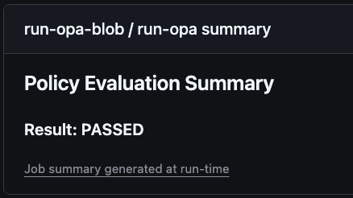
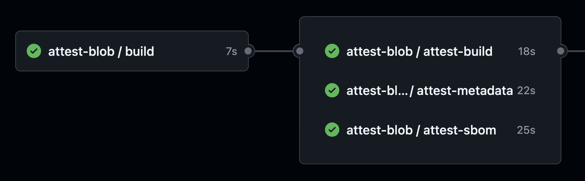
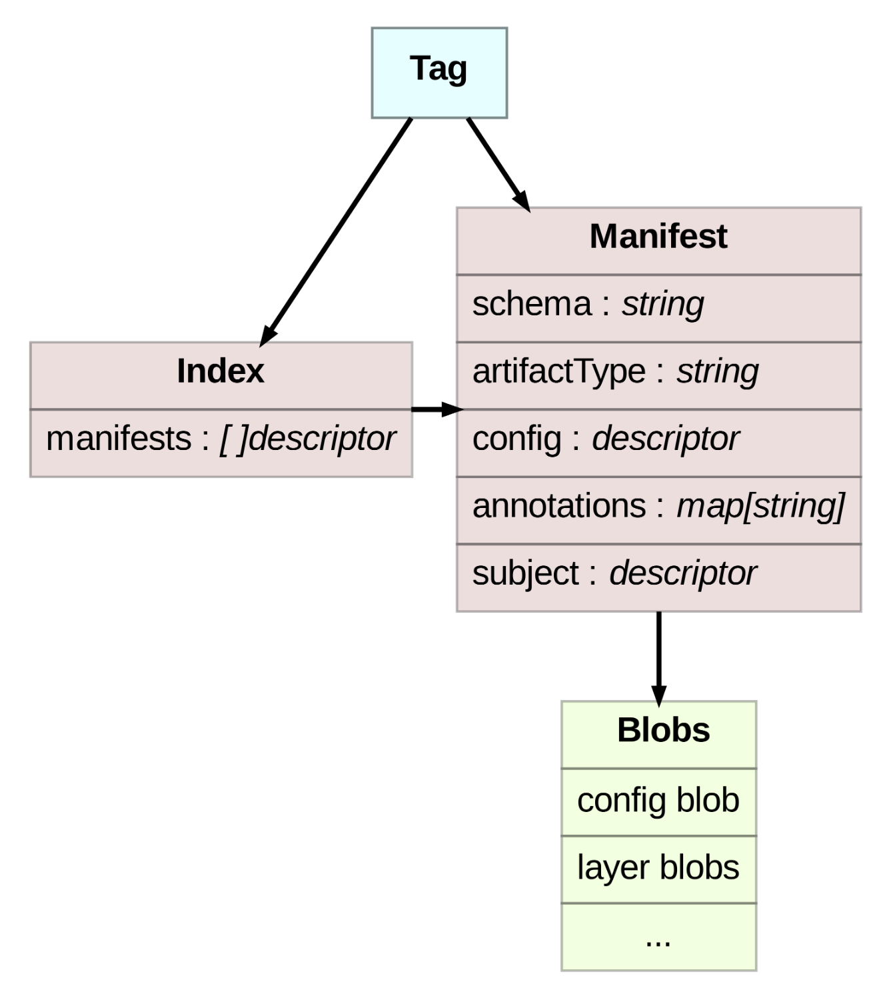
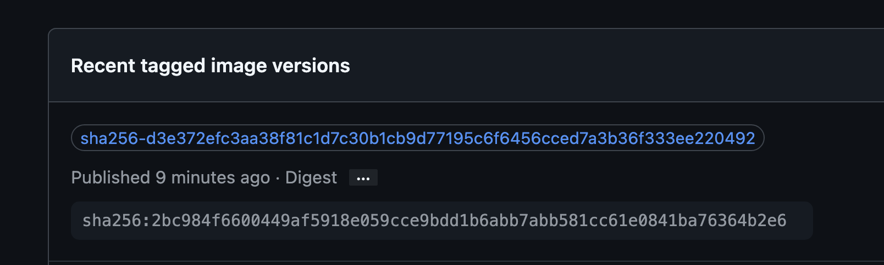
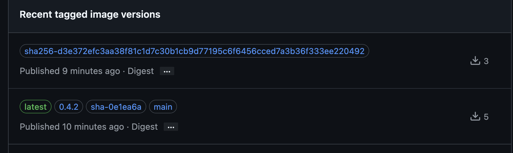

# Reusable Workflows using GitHub Artifact Attestations

- [Quick Start Guide](#quick-start-guide)
- [Paving the Path](#paving-the-path)
- [Achieving SLSA Build Levels Using Reusable Workflows](#achieving-slsa-build-levels-using-reusable-workflows)
  - [L3: Isolation of Build from Attest](#l3-isolation-of-build-from-attest)
  - [L2: Ensure a Trusted Build Environment](#l2-ensure-a-trusted-build-environment)
  - [L1: Documented Build Parameters](#l1-documented-build-parameters)
- [Usage](#usage)
  - [GitHub Artifact Attestation Actions and Other Tools Used](#github-artifact-attestation-actions-and-other-tools-used)
  - [Configure Access](#access)
  - [Inputs](#inputs)
  - [Outputs](#outputs)
  - [Example Workflow Snippets](#example-workflow-snippets)
- [Troubleshooting](#troubleshooting)
- [Additional Resources/Documentation](#additional-resourcesdocumentation)

## Quick Start Guide

1. **Configure Access**:
   Ensure you have the necessary permissions and tokens configured in your remote caller repository described in the [access section](#access) below.
   - **Permissions**: Ensure you have the [necessary permissions to run the workflows](#workflow-access).
   - **Tokens**: Set up the [required tokens](#repository-access) for policy bundle access.
2. **Create Your Local Composite Actions**:
   For example create `.github/actions/build-image/action.yaml` for images or `.github/actions/build-blob/action.yaml` for blobs:

**`build-image`Composite Action**

```yaml
inputs:
  subject-name:
    description: The name for the image.
    required: true
    default: ${{ github.repository }}
    description: >
      Primarily for demo purposes and specific only to the build-image composite action so that it is unnecessary to manually change it when wanting to flip from high permissions to low permissions.
    default: "false"
    required: false
  github-token:
    description: >
      The GitHub token set throughout the reuseable workflow including the composite (build) action.
    required: false
    default: ''
outputs:
  image-digest:
    description: The image digest of the image that was built from the build-image job.
    value: ${{ steps.build-image.outputs.digest }}

runs:
  using: composite
  steps:
    - name: Get Next Semantic Release Tag
      id: semantic-release
      if: github.ref == 'refs/heads/main' && github.event_name == 'push'
      uses: go-semantic-release/action@48d83acd958dae62e73701aad20a5b5844a3bf45 # v1.23.0
      with:
        dry: true
        allow-initial-development-versions: true
        github-token: ${{ inputs.github-token || github.token }}
    - name: Image Metadata
      id: meta
      uses: docker/metadata-action@8e5442c4ef9f78752691e2d8f8d19755c6f78e81 # v5.5.1
      with:
        images: ${{ inputs.subject-name }}
        tags: |
          type=ref,event=branch
          type=sha
          type=raw,value=latest,enable=${{ github.ref == 'refs/heads/main' && github.event_name == 'push' }}
          type=raw,value=${{ steps.semantic-release.outputs.version }},enable=${{ github.ref == 'refs/heads/main' && github.event_name == 'push' }}
    - name: Set up QEMU
      uses: docker/setup-qemu-action@49b3bc8e6bdd4a60e6116a5414239cba5943d3cf # v3.2.0
    - name: Set up Docker Buildx
      uses: docker/setup-buildx-action@c47758b77c9736f4b2ef4073d4d51994fabfe349 # v3.7.1
    - name: Log in to GitHub Container Registry
      uses: docker/login-action@9780b0c442fbb1117ed29e0efdff1e18412f7567 # v3.3.0
      with:
        registry: ghcr.io
        username: ${{ github.actor }}
        password: ${{ inputs.github-token || github.token }}
    - name: Build and push Docker image
      uses: docker/build-push-action@4f58ea79222b3b9dc2c8bbdd6debcef730109a75 # v6.9.0
      id: build-image
      with:
        context: .
        file: Dockerfile
        push: true
        platforms: linux/amd64,linux/arm64
        tags: ${{ steps.meta.outputs.tags }}
        labels: ${{ steps.meta.outputs.labels }}
        outputs: type=oci,dest=/tmp/image.tar
        cache-from: type=gha
        cache-to: type=gha,mode=max
```

**`build-blob`Composite Action**

```yaml
runs:
  using: composite
  steps:
    - name: Build Blob
      shell: bash
      run: |
        echo "i am a blob being created at $(date +'%Y-%m-%d %H:%M:%S') by ${{ github.triggering_actor }} by rw of
        ${{ github.workflow_ref }} in the repo of ${{ github.repository }} by the action known as ${{ github.action }}." > i_am_blob &&
        echo "i am another blob being created at $(date +'%Y-%m-%d %H:%M:%S') by ${{ github.triggering_actor }} by rw of
        ${{ github.workflow_ref }} in the repo of ${{ github.repository }}" > i_am_another_blob
```

Other examples like an npm package:

OCI:

```yaml
inputs:
...
  node-version:
    description: The Node.js version to use
    required: false
    default: '20'
  registry-url:
    description: The npm registry URL
    required: false
    default: 'https://npm.pkg.github.com'
...
    - name: Setup Node.js
      uses: actions/setup-node@v4
      with:
        node-version: ${{ inputs.node-version }}
        registry-url: ${{ inputs.registry-url }}
        scope: '@${{ github.repository_owner }}'
    - name: Install dependencies
      shell: bash
      run: npm ci
    - name: Build package
      shell: bash
      run: npm run build
...
```

Blob:

```yaml
    - name: Setup Node.js
      uses: actions/setup-node@39370e3970a6d050c480ffad4ff0ed4d3fdee5af # v4.1.0
      with:
        node-version: ${{ inputs.node-version }}
        registry-url: ${{ inputs.registry-url }}
        scope: '@${{ github.repository_owner }}'
    - name: Install dependencies
      shell: bash
      run: npm ci
    - name: Build package
      shell: bash
      run: npm run build
    - name: Pack npm package
      shell: bash
      run: npm pack
```

^ Ensure the value of `subject-path` is the output (e.g. or glob pattern) of the `npm`/`yarn pack` command (e.g. `liatrio-simple-greeter-1.0.0.tgz`).

Examples of the associated `tsconfig.json` / `package.json` files respectively:

```json
{
  "compilerOptions": {
    "target": "es2020",
    "module": "commonjs",
    "declaration": true,
    "outDir": "./dist",
    "strict": true,
    "esModuleInterop": true,
    "skipLibCheck": true,
    "forceConsistentCasingInFileNames": true
  },
  "include": [
    "src"
  ],
  "exclude": [
    "node_modules",
    "**/*.test.ts"
  ]
}
```

```json
{
    "name": "@liatrio/simple-greeter",
    "version": "1.0.0",
    "lockfileVersion": 3,
    "requires": true,
    "packages": {
...
    }
}
```

3. **Create Your Caller Workflows / Configure Inputs**:

Pick one of the following four jobs (e.g. job definitions) depending on desired build type and permissions:

**`cw-build.yaml`**:

### Calling Reuseable Workflow

```yaml
name: Build Entrypoint Caller Workflow

on:
    workflow_dispatch:
    push:

jobs:
  attest-image-hp: #image
    permissions:
      id-token: write
      attestations: write
      packages: write
      contents: write
    uses: liatrio/liatrio-gh-autogov-workflows/.github/workflows/rw-hp-build-image.yaml@<commit_sha> # <semver> / a commit SHA from an official liatrio-gh-autogov-workflows release
    secrets: inherit
    with:
      subject-name: ${{ github.repository }}
      registry: ghcr.io
      cert-identity: https://github.com/liatrio/liatrio-gh-autogov-workflows/.github/workflows/rw-hp-attest-image.yaml@<commit_sha> # <semver> / a commit SHA from an official liatrio-gh-autogov-workflows release

  attest-blob-hp: #blob
    permissions:
      id-token: write
      attestations: write
      packages: read
      contents: write
    uses: liatrio/liatrio-gh-autogov-workflows/.github/workflows/rw-hp-build-blob.yaml@<commit_sha> # <semver> / a commit SHA from an official liatrio-gh-autogov-workflows release
    secrets: inherit
    with:
      subject-path: |
        i_am_blob
        i_am_another_blob
      cert-identity: https://github.com/liatrio/liatrio-gh-autogov-workflows/.github/workflows/rw-hp-attest-blob.yaml@<commit_sha> # <semver> / a commit SHA from an official liatrio-gh-autogov-workflows release

  attest-blob-lp: #blob
    permissions:
      id-token: write
      attestations: write
      contents: write
    uses: liatrio/liatrio-gh-autogov-workflows/.github/workflows/rw-lp-build-blob.yaml@<commit_sha> # <semver> / a commit SHA from an official liatrio-gh-autogov-workflows release
    secrets: inherit
    with:
      subject-path: |
        i_am_blob
        i_am_another_blob
      cert-identity: https://github.com/liatrio/liatrio-gh-autogov-workflows/.github/workflows/rw-lp-attest-blob.yaml@<commit_sha> # <semver> / a commit SHA from an official liatrio-gh-autogov-workflows release
```

4. **Run the Workflow**:
   Trigger the workflow using one of the supported event types:

    - [`push`] / [creation or update of a git tag or branch](https://docs.github.com/en/actions/using-workflows/events-that-trigger-workflows#create).
    - [`release`] / [creation or update of a GitHub release](https://docs.github.com/en/actions/using-workflows/events-that-trigger-workflows#release).
    - [`create`] / [creation of a git tag or branch](https://docs.github.com/en/actions/using-workflows/events-that-trigger-workflows#push).
    - [`workflow_dispatch`] / [enables the ability to trigger workflow manually](https://docs.github.com/en/actions/using-workflows/events-that-trigger-workflows#workflow_dispatch).

5. **Check Results**:
   Review the results and logs to ensure everything is working as expected.



## Why Sign/Attest?

In today's digital landscape, ensuring the integrity and security of software development processes is crucial. GitHub's official Action(s) for creating signed SLSA (Supply Chain Levels for Software Artifacts) attestations, along with its [CLI tool for verifying artifacts](https://cli.github.com/manual/gh_attestation), provides a robust foundation for securing the distribution of built artifacts.

SLSA is a security framework designed to prevent tampering, improve integrity, and secure packages and infrastructure. It provides a checklist of standards and controls to enhance software supply chain security. For more details, visit the [SLSA website](https://slsa.dev/).

To achieve [SLSA Build Level 3](https://slsa.dev/spec/v1.0/levels#build-l3), which mitigates risks such as:

- Running builds on self-hosted runners
- Unapproved code changes
- Exposed credentials associated with attestation signing material
- [Hard-to-follow build steps](https://slsa.dev/spec/v1.0/provenance#BuildDefinition)

GitHub recommends using [reusable workflows](https://github.com/slsa-framework/github-actions-buildtypes/tree/main/workflow/v1).

This README outlines how our services can help your organization implement a Reusable Workflow to meet SLSA Build Level 3 requirements, ensuring a secure and compliant Software Development Life Cycle (SDLC).

By implementing this reusable workflow, your organization can achieve SLSA Build Level 3 compliance, ensuring a secure and verifiable software development process. Our team is ready to assist you in integrating these automated governance technologies into your SDLC, enhancing the security and integrity of your software artifacts.

### GitHub Artifact Attestations

GitHub Artifact Attestations is a feature that enables developers to generate cryptographically signed attestations that verify the provenance of software artifacts created during CI/CD pipelines. These attestations are based on the Open Container Initiative (OCI) format and follow the SLSA (Supply Chain Levels for Software Artifacts) framework, but can also work against blob or files. Attestations provide verifiable metadata about how, when, and by whom an artifact was built, ensuring integrity and preventing tampering.

By using any of GitHub's attest Actions, developers can automate the creation of attestations directly in their pipelines. These attestations are signed and associated with build artifacts, which can then be stored in OCI-compliant registries. The signatures can be verified using GitHub's own tools or [external tools like Sigstore's `cosign`](https://blog.sigstore.dev/cosign-verify-bundles/), ensuring that any unauthorized changes or modifications to the artifact can be detected.

This offering is now generally available, as announced in June 2024, with public repositories using Sigstore's public instance for signing, while private repositories are backed by GitHub's private Sigstore instance. This ensures that all repositories can integrate artifact attestations into their workflows while maintaining the same level of cryptographic security.

For more information, visit the [GitHub documentation on artifact attestations](https://docs.github.com/en/actions/security-for-github-actions/using-artifact-attestations/using-artifact-attestations-to-establish-provenance-for-builds).

### The SLSA Build Track

There are a variety of necessary checkboxes ✅ required to achieve different SLSA Build Levels on the SLSA [build track](https://slsa.dev/spec/v1.0/levels#build-track), which sets expectations for achieving each Build Level without assumptions.

For build provenance attestation, "the lowest level only requires the provenance to exist, while higher levels provide increasing protection against tampering of the build, the provenance, or the artifact." It is specifically through the verification process that it is confirmed that they were "built as expected," preventing a variety of [supply chain threats](https://slsa.dev/spec/v1.0/threats).

## Sigstore

Sigstore is an open-source project that aims to improve the security of the software supply chain by providing a set of tools for signing, verifying, and storing software artifacts. It includes several key components:

- **Rekor**: A transparency log that records signed metadata, providing an immutable and publicly auditable record of software artifacts and their provenance. This helps ensure that the artifacts have not been tampered with and can be traced back to their source. For more details, visit the [Rekor GitHub repository](https://github.com/sigstore/rekor).
- **Fulcio**: A certificate authority that issues short-lived certificates based on OpenID Connect (OIDC) identities. This allows for "keyless" signing, where the private key is ephemeral and never leaves the memory of the signing process. For more details, visit the [Fulcio GitHub repository](https://github.com/sigstore/fulcio).
- **Cosign**: A tool for signing and verifying container images and other artifacts. It integrates with Fulcio and Rekor to provide a seamless signing and verification experience. For more details, visit the [Cosign GitHub repository](https://github.com/sigstore/cosign).

GitHub's artifact attestation feature leverages Sigstore using GitHub's own private Sigstore instance (e.g. private repositories use their private instance and public repositories utilize Sigstore's public good instance) to create a verifiable link between software artifacts and their source code and build instructions. By using GitHub Actions, developers can easily generate and verify signed attestations, ensuring the integrity and security of their software supply chain.

For more details, you can refer to the [GitHub blog post](https://github.blog/news-insights/product-news/introducing-artifact-attestations-now-in-public-beta/) and the [Sigstore blog](https://blog.sigstore.dev/cosign-verify-bundles/). Additionally, the [Cosign GitHub repository](https://github.com/sigstore/cosign) provides comprehensive documentation and examples.

### Paving the Path

To achieve SLSA Build Level 3, we recommend using GitHub-native tools and reusable workflows. Our approach is inspired by the slsa-framework's implementations, specifically [slsa-github-generator](https://github.com/slsa-framework/slsa-github-generator/blob/main/BYOB.md#build-your-own-builder-byob-framework) and [slsa-verifier](https://github.com/slsa-framework/slsa-verifier), and provides a model for securing your software development process.

["The only way to interact with a reusable workflow is through the input parameters it exposes to the calling workflow."](https://github.com/slsa-framework/slsa-github-generator/blob/3d34abbe34b268bb6c02651df2117370e8cee1bd/SPECIFICATIONS.md#interference-between-jobs)

```shell
                    ┌──────────────────────┐         ┌───────────────────────────────┐
                    │                      │         │                               │
                    │  Source Repository   │         │       Trusted Builder         │
                    │  -----------------   │         │     (Reusable Workflow)       │
                    │                      │         │     -------------------       │
                    │                      │         │                               │
                    │ .caller-workflow.yaml│         │                               │
                    │                      ├─────────┼─────────────┐                 │
                    │                      │         │             │                 │
                    │                      │         │   ┌─────────▼────────────┐    │
                    │   User Workflow      │         │   │     Build            │    │
                    │                      │         │   └──────────────────────┘    │
                    └──────────────────────┘         │             │                 │
                                                     │   ┌─────────▼────────────┐    │
                                                     │   │  Generate Provenance │    │
                                                     │   └─────────┬────────────┘    │
                                                     │             │                 │
                                                     └─────────────┼─────────────────┘
                                                                   │
                                                                   │
                                                     ┌─────────────▼─────────────────┐
                                                     │                               │
                                                     │   Binary    Signed Provenance │
                                                     │                               │
                                                     │                               │
                                                     │         Artifacts             │
                                                     │         ---------             │
                                                     └───────────────────────────────┘
```

This diagram illustrates the process of using a reusable workflow to achieve SLSA Build Level 3. The source repository contains the caller workflow, which interacts with the trusted builder (reusable workflow) to build the artifacts and generate signed provenance. The artifacts and their signed provenance are then securely stored and can be verified to ensure their integrity.

## Achieving SLSA Build Levels Using Reusable Workflows

### Verification

Often the focus is put upon the "signing" of an artifact to attest to its integrity, but the source of value lies within [verifying artifacts](https://slsa.dev/spec/v1.0/verifying-artifacts). GitHub offers the ability to download and verify attestations using the [GitHub Attestation Command](https://cli.github.com/manual/gh_attestation).

The `gh attestation verify` command requires the path to a local or [OCI](https://opencontainers.org/) artifact as well as an expected source `--owner` or `--repo`. By default, the CLI does not check the `--signer-workflow` or its equivalent: `--cert-identity`.

Considering many organizations and/or developers run builds and workflows from non-official branches, we impose additional requirements for the verifier to ensure that both the source repository and signer workflow are from approved branches or tags (e.g. commit hash). Verifying the signing workflow's branch ensures that the artifact was built to meet SLSA Level 3 requirements.

**Note**: Currently, gh-cli does not support verification via the source branch directly. To address this, we use a combination of the `--jq` option and `grep` to perform this check.

```yaml
- name: Verify Image Attestation(s)
  run: |
      set +x
      gh attestation verify \
        oci://${{ inputs.subject-name }}@${{ inputs.image-digest }} \
        --repo ${{ github.repository }} \
        --deny-self-hosted-runners \
        --cert-identity \
        "${{ inputs.cert-identity }}" \
        --format json \
        --jq '.[].verificationResult.signature.certificate.sourceRepositoryRef' \
      | grep "^${{ github.ref }}$"
      ...
- name: Verify Blob Attestation(s)
  env:
      ARTIFACTS_FOLDER: ./artifacts
  run: |
      set +x
      for ARTIFACT in ${{ env.ARTIFACTS_FOLDER }}/*; do
        gh attestation verify \
          $ARTIFACT \
          --deny-self-hosted-runners \
          --repo ${{ github.repository }} \
          --cert-identity "${{ inputs.cert-identity }}" \
          --format json \
          --jq '.[].verificationResult.signature.certificate.sourceRepositoryRef' \
        | grep "^${{ github.ref }}$"
      ...
```

Again, verifying via the Reusable Workflow's GitHub reference (e.g. commit SHA, branch, tag etc) helps to thwart source repositories and/or signer workflows from being used that are not using approved branches, tags, or commit SHAs:

```yaml
cert-identity:
    description: >
        The certificate identity of the signer workflow, or builder, used in the verify job to ensure artifacts and attestations can be verified against the source repository and correct workflow using the gh-cli (e.g. --cert-identity flag). If verifying an image, the workflow name should be rw-<permissions_path>-attest-image.yaml, if verifying blob(s), the workflow name should be rw-<permissions_path>-attest-blob.yaml.
```

Our approach guarantees that both the source repository and the signer workflow originate from approved branches or tags, providing confidence that the artifact was built to meet SLSA Level 3 requirements as long as whomever is verifying is diligent and remembers to include the `cert-identity` (e.g. also known as `signer-workflow`) flag via the gh-cli.

#### Certificate Identities

This repository maintains a `cert-identities.json` file that serves as the source of truth for valid certificate identities used by [autogov-verify](https://github.com/liatrio/autogov-verify). The file contains:

- **Latest**: Current reusable workflow identities at the current version
- **Approved**: All approved workflow identities (includes both current and previous versions)
- **Revoked**: Identities that have been explicitly revoked and should not be used

The certificate identities file is automatically updated during the semantic release process. When a new version is released, all reusable workflows (files matching `.github/workflows/rw-*.yaml`) are added to the certificate identities file with their full commit SHA identities.

##### How Certificate Identities Work

Certificate identities provide a way to verify that a workflow being called is an approved version. Each identity consists of:

- A unique name (e.g., "HP ATTEST IMAGE v0.4.0")
- The full URL to the workflow file including its commit SHA
- A description of its purpose
- Addition and expiration dates

When consuming these workflows, you should reference them using their full identity URL with commit SHA rather than using branch references, to ensure immutability and security.

### Verification Using Cosign

It is also possible to use Sigstore's own [cosign](https://github.com/sigstore/cosign) to [verify bundles](https://blog.sigstore.dev/cosign-verify-bundles/) though this is [currently not documented](https://github.com/actions/attest-build-provenance/issues/162) and only through `cosign verify-blob-attestation` which requires other tools (regctl or Docker) to verify images in order to grab the necessary OCI artifacts.

*To be further agnostic, the below steps will not use the `gh attestation` command.*

#### Verification Prerequisites

1. Install cosign:

```shell
# Using Homebrew
brew install cosign

# Or download directly from GitHub releases
# Visit: https://github.com/sigstore/cosign/releases
```

2. Create a trusted root file:

```shell
# Create the trusted root file for GitHub's Fulcio instance
gh attestation trusted-root | jq '.|select(.certificateAuthorities[0].uri=="fulcio.githubapp.com")' > github-trusted-root.json
```

3. Ensure you are authenticated with ghcr.io via Docker using a PAT with the package read permission:

```shell
# Login using PAT as the password
docker login ghcr.io
```

##### Image Verification Prerequisites

Before verifying image/OCI attestations, you'll need:

Install regctl (if using the regctl method):

```shell
# Using Homebrew
brew install regclient

# Or download directly from GitHub releases
# Visit: https://github.com/regclient/regclient/releases
```

###### Verifying Images Using regctl

```shell
# Get the manifest
regctl manifest get --format raw-body ghcr.io/liatrio/liatrio-gh-autogov-workflows@<image_digest> > manifest.json

# Calculate digest
DIGEST="sha256-$(sha256sum manifest.json | awk '{ print $1 }')"

# Get the attestation bundle
regctl artifact get ghcr.io/liatrio/liatrio-gh-autogov-workflows:${DIGEST} > bundle.json

# Verify the attestation
cosign verify-blob-attestation \
  --bundle bundle.json \
  --trusted-root github-trusted-root.json \
  --new-bundle-format \
  --use-signed-timestamps \
  --insecure-ignore-sct \
  --certificate-oidc-issuer="https://token.actions.githubusercontent.com" \
  --certificate-identity="https://github.com/liatrio/liatrio-gh-autogov-workflows/.github/workflows/rw-hp-attest-image.yaml@${github.ref}" \
  manifest.json
```

###### Verifying Images Using Docker

If you don't have regctl installed, you can use standard Docker commands:

```shell
# Get the manifest
docker manifest inspect ghcr.io/liatrio/liatrio-gh-autogov-workflows@<image_digest> > manifest.json

# Calculate digest
DIGEST="sha256-$(sha256sum manifest.json | awk '{ print $1 }')"

# Pull and extract the attestation bundle
docker pull ghcr.io/liatrio/liatrio-gh-autogov-workflows:${DIGEST}
docker save ghcr.io/liatrio/liatrio-gh-autogov-workflows:${DIGEST} -o bundle.tar
tar -xf bundle.tar
cat manifest.json | jq '.[0].Config' | xargs cat > bundle.json

# Verify the attestation
cosign verify-blob-attestation \
  --bundle bundle.json \
  --trusted-root github-trusted-root.json \
  --new-bundle-format \
  --use-signed-timestamps \
  --insecure-ignore-sct \
  --certificate-oidc-issuer="https://token.actions.githubusercontent.com" \
  --certificate-identity="https://github.com/liatrio/liatrio-gh-autogov-workflows/.github/workflows/rw-hp-attest-image.yaml@${github.ref}" \
  manifest.json
```

##### Verifying Blob Attestations

```shell
cosign verify-blob-attestation \
  --trusted-root github-trusted-root.json \
  --bundle bundle.jsonl \
  --use-signed-timestamps \
  --insecure-ignore-sct \
  --new-bundle-format \
  --certificate-oidc-issuer="https://token.actions.githubusercontent.com" \
  --certificate-identity="https://github.com/liatrio/liatrio-gh-autogov-workflows/.github/workflows/rw-lp-attest-blob.yaml@${github.ref}" \
  <path_to_blob>
```

### Verification Using ORAS

In addition to using Cosign and the GitHub CLI, you can use ORAS (OCI Registry As Storage) commands to inspect and verify artifact attestations. This is particularly useful for understanding the relationship between image digests and their associated attestation layers.

#### Understanding OCI Layers and Attestations

When working with container images and their attestations in an OCI registry, you might notice additional digests that don't seem to correspond to an actual image. These are typically artifact manifests containing attestations. Here's how to inspect them:

1. First, install ORAS:

```bash
# Using Homebrew
brew install oras-cli

# Or download from GitHub releases
# Visit: https://github.com/oras-project/oras/releases
```

2. Use ORAS to discover referrers (attestations) of an image:

```bash
oras discover ghcr.io/your-org/your-repo@<image_digest>
```

For example, examining attestations for our policy library image:

```bash
❯ oras manifest fetch ghcr.io/liatrio/liatrio-rego-policy-library:sha256-d3e372efc3aa38f81c1d7c30b1cb9d77195c6f6456cced7a3b36f333ee220492 | jq -r
{
  "mediaType": "application/vnd.oci.image.index.v1+json",
  "schemaVersion": 2,
  "manifests": [
    {
      "mediaType": "application/vnd.oci.image.manifest.v1+json",
      "digest": "sha256:ec4898a09dd73d59882d82c3b02cd78e9ce471ccf3f28472563c9b250d1964e9",
      "size": 814,
      "artifactType": "application/vnd.dev.sigstore.bundle.v0.3+json",
      "annotations": {
        "org.opencontainers.image.created": "2025-01-24T20:47:58.951Z",
        "dev.sigstore.bundle.content": "dsse-envelope",
        "dev.sigstore.bundle.predicateType": "https://slsa.dev/provenance/v1"
      }
    },
    // ... other attestation layers ...
  ]
}
```

Example of Sigstore Bundle Attestation / `application/vnd.dev.sigstore.bundle.v0.3+json`:

```json
{
  "schemaVersion": 2,
  "mediaType": "application/vnd.oci.image.manifest.v1+json",
  "artifactType": "application/vnd.dev.sigstore.bundle+json;version=0.2",
  "config": {
    "mediaType": "application/vnd.oci.empty.v1+json",
    "digest": "sha256:44136fa355b3678a1146ad16f7e8649e94fb4fc21fe77e8310c060f61caaff8a",
    "size": 2
  },
  "layers": [
    {
      "mediaType": "application/vnd.dev.sigstore.bundle+json;version=0.2",
      "digest": "sha256:4bd9df17d3cfa8632690f6251b7dc6d2f7cebd60313c49bea4092b9489e2d4a4",
      "size": 4967
    }
  ],
  "subject": {
    "mediaType": "application/vnd.docker.distribution.manifest.v2+json",
    "digest": "sha256:010511b82573da0735bbbc09ab0b1b9e9218732306d96b81beb694cfe431a499",
    "size": 523
  }
}
```

- `artifactType` defines the Sigstore bundle's media type, useful for registry compatibility.
- The `config` section uses an empty configuration (`application/vnd.oci.empty.v1+json`) since the bundle doesn't need specific configuration data.
- The `layers` array holds the Sigstore bundle content, with its size and hash.
`subject` points to the associated artifact or image that the Sigstore bundle attests to, linking it with its own media type and digest.

#### Important Notes About Attestation Layers

1. **Image Manifests**: You can use a variety of tools to inspect the actual image manifest such as Docker:

```bash
❯ docker manifest inspect ghcr.io/your-org/your-repo:sha256-<attestation_digest>
{
   "schemaVersion": 2,
   "mediaType": "application/vnd.oci.image.index.v1+json",
   "manifests": [
      {
...
      }
   ]
}
```

But, if you try to pull an unsupported OCI artifact via Docker you'll get:

```bash
❯ docker pull ghcr.io/your-org/your-repo:sha256-<attestation_digest>
sha256-<attestation_digest>: Pulling from <repo>>
unsupported media type application/vnd.oci.empty.v1+json
```

2. **Attestation Manifests**: The additional digests you see in the registry that don't correspond to actual images are artifact manifests containing attestations. While these won't be visible through standard Docker commands, they can be inspected using ORAS:

```bash
# This will fail as it's an attestation manifest, not an image
❯ docker inspect ghcr.io/your-org/your-repo:sha256-<attestation_digest>
[]
Error: No such object

# Use ORAS instead to discover attestation relationships
❯ oras discover ghcr.io/your-org/your-repo:sha256-<attestation_digest>
```

3. **Layer Types**: In the manifest, you'll notice different `artifactType` values corresponding to different attestations:
   - `application/vnd.dev.sigstore.bundle.v0.3+json`: Sigstore bundle format
   - `https://slsa.dev/provenance/v1`: SLSA provenance attestation
   - `https://cosign.sigstore.dev/attestation/v1`: Cosign attestation
   - `https://cyclonedx.org/bom`: SBOM attestation

For more detailed information about ORAS commands and capabilities, refer to the [ORAS documentation](https://oras.land/docs/commands/oras_discover/).

### L3: Isolation of Build from Attest

To achieve [SLSA Build Level 3](https://slsa.dev/spec/v1.0/levels#build-l3-hardened-builds), we ensure that builds and their artifacts are isolated from one another, as well as ensuring artifacts are securely uploaded and downloaded, preventing other jobs from inadvertently or maliciously altering them.

Using GitHub Actions, this simply requires the separation of the signing process into its own job. Additionally, it's important to ensure the jobs are executed on GitHub's hardened runners, "intentionally" avoiding any "self-hosted" runners. Next, to accommodate different build styles, we can enhance the reusable workflow by abstracting build commands into a [Composite Action](https://docs.github.com/en/actions/sharing-automations/creating-actions/about-custom-actions#composite-actions) located at a well-defined place in your repository.

The reusable workflow will execute the repository's locally available composite action to build either an image or blob (or both), followed by attesting the artifacts in a separate attesting job.



This diagram illustrates the isolation of the build and attestation processes. By separating these processes into distinct jobs and ensuring they run on GitHub's hardened runners, we can prevent inadvertent or malicious alterations to the artifacts.

#### Isolation of Job Artifacts

To further isolate between jobs, the build job uploads the artifact(s) (or in the case of building an image, pushes the image to a container registry) to the downstream attest/sign job to download. Jobs in the calling workflow, outside of our reusable workflow, could unintentionally overwrite the artifact by uploading one with the same name. This risks the attest/sign job attesting to the wrong artifact.

The [actions/upload-artifact](https://github.com/actions/upload-artifact) now enables immutable uploads using artifact IDs, though currently [actions/download-artifact](https://github.com/actions/download-artifact) does not support downloading artifacts by the artifact ID. Temporarily, we utilize [actions/github-script](https://github.com/actions/github-script) in tandem with the [@actions/artifact library](https://www.npmjs.com/package/@actions/artifact) to further secure artifact downloads as it [does support this functionality](https://github.com/actions/download-artifact/blob/fa0a91b85d4f404e444e00e005971372dc801d16/src/download-artifact.ts#L114-L122).

While uploads via `actions/upload-artifact` are designed to be immutable with an artifact ID, the `actions/download-artifact` does not currently support this.

```yaml
- name: download-artifact
  uses: actions/github-script@60a0d83039c74a4aee543508d2ffcb1c3799cdea # v7.0.1
  env:
      ARTIFACT_ID: ${{ needs.build.outputs.build-artifact-id }}
      ARTIFACTS_FOLDER: ./artifacts
  with:
      script: |
      const { DefaultArtifactClient } = require('@actions/artifact');
      const artifactClient = new DefaultArtifactClient();
      const artifactId = process.env.ARTIFACT_ID;

      if (!artifactId) {
          throw new Error('Artifact ID is not defined');
      }

      await artifactClient.downloadArtifact(artifactId, { path: process.env.ARTIFACTS_FOLDER });
      console.log(`Downloaded artifact with ID: ${artifactId} to ${process.env.ARTIFACTS_FOLDER}`);
```

##### Reducing Permissions Further

Our reuseable workflow(s) require a number of permissions especially with image builds since all image attestations rely on a container registry (e.g. GitHub Container Registry, Docker Hub, etc) to either "receive" a push or "transmit" attestations associated with a particular image-digest (e.g. subject-digest). To remedy this we rely on image artifacts, as we do with blob builds, to [pass data between jobs](https://docs.github.com/en/actions/writing-workflows/choosing-what-your-workflow-does/storing-and-sharing-data-from-a-workflow#passing-data-between-jobs-in-a-workflow). Doing this we are able to lower permissions and [handle the image as a tar file](https://docs.docker.com/build/ci/github-actions/share-image-jobs) passing it to downstream job(s).

Also, to avoid additional permissions for online verification the bundle and trusted-root are simply passed as artifacts to [verify attestations without an internet connection](https://docs.github.com/en/actions/security-for-github-actions/using-artifact-attestations/verifying-attestations-offline).

The following permissions are used for images when used as a blob via the low permissions, or "lp", reuseable workflow files:

```yaml
attest:
  permissions:
    id-token: write
    attestations: write
    packages: read
    contents: read
    actions: read
verify:
  permissions:
    contents: read
run-opa:
  permissions:
    contents: read
```

Otherwise the following permissions are using (e.g. container registry access etc):

```yaml
attest:
  permissions:
    id-token: write
    attestations: write
    packages: write
    contents: write
    actions: read
verify:
  permissions:
    id-token: write
    attestations: read
    packages: read
run-opa:
  permissions:
    id-token: write
    attestations: read
```

###### Using Lower Permissions: Image Digest Differences

The digest of an exported image tarball will always differ from the digest of the pushed image in the registry.

This happens because:

- Compression Differences: The image tarball generated by docker save is uncompressed, while the images pushed to registries are typically compressed (e.g., with gzip). The compression changes the contents and results in different digests.
- Layer Digests: Docker calculates the digest of each layer independently, and any difference in how layers are packaged or compressed (as with a tarball vs. pushed layers) will result in different final digests.
- Metadata: There can be slight differences in the metadata, such as timestamps and other details, that are included in the image manifest when pushing to a registry versus what's exported in the tarball.

So, while you can work towards making the image as reproducible as possible, the differences in how Docker handles the compression and layers when saving versus pushing mean that the digests will almost always be different. An additional step could be to compare the individual layer digests instead of the overall image digest, as they will likely match across both the tarball and the pushed image.

### L2: Ensure a Trusted Build Environment

To achieve [SLSA Build Level 2](https://slsa.dev/spec/v1.0/levels#build-l2-hosted-build-platform), builds must "run on a hosted platform that generates and signs the provenance," otherwise known as a "trusted build platform."

#### Checking for Self-hosted Runners

Self-hosted runners [can be maliciously modified](https://docs.github.com/en/enterprise-cloud@latest/actions/hosting-your-own-runners/managing-self-hosted-runners/about-self-hosted-runners#self-hosted-runner-security) by their host, but GitHub can provide safe GitHub-hosted runners to help protect the integrity of the build.

The `rw-<permissions_path>-attest-<build-type>.yaml` runs the respective repository's composite action (e.g. `./github/actions build-<blob_or_image>`) with a runner-label that you may supply as input. However, if a user has a [self-hosted runner labeled "ubuntu-latest"](https://github.com/slsa-framework/slsa-github-generator/issues/1868#issuecomment-1979426130) or GitHub-hosted default runner labels, then GitHub Actions may still queue the job on their self-hosted runners.

#### Verifying GitHub-Hosted Runners

We employ a variety of methods to check if the build, signing, and verifying steps are not occurring on a self-hosted runner, but there is also the `--deny-self-hosted-runners` option that can be used in conjunction with the `gh attestation verify` command mentioned above.

Below, we rely on the [runner's context](https://docs.github.com/en/actions/writing-workflows/choosing-what-your-workflow-does/accessing-contextual-information-about-workflow-runs#runner-context), which contains a variety of data about the runner executing the current job. Specifically, we check `runner.environment` which, as per GitHub, represents "the environment of the runner executing the job. Possible values are: `github-hosted` for GitHub-hosted runners provided by GitHub, and `self-hosted` for self-hosted runners configured by the repository owner."

Using the following check, a user can be sure that their pipeline is executing on a `github-hosted` runner:

```yaml
- name: Fail if Runner is self-hosted
  if: ${{ runner.environment != 'github-hosted' }}
  run: |
      echo "Job is running on a self-hosted runner. Terminating job..."
      exit 1
```

Once `exit 1` occurs, we can be sure that our build (or whatever else; signing/verifying) is not running on a `github-hosted` runner.

```yaml
jobs:
  build:
    ...
    steps:
      ...
      - name: Build Image
        if: ${{ runner.environment == 'github-hosted' }}
        id: build-image
        uses: ./.github/actions/build-image
        with:
          subject-name: ${{ inputs.subject-name }}
      ...
      - name: Build Blob
        if: ${{ runner.environment == 'github-hosted' }}
        id: build-blob
```

#### Acceptable Leeway in an Effort to be Secure

Something we feel is acceptable is to offer control over the workflow's runner label (e.g. `runs-on: ${{ inputs.workflow-runner-label }}`). From a SLSA perspective, this is an external parameter that could potentially not be documented either as a commit or as provenance, though the subtleties of a runner's OS (`ubuntu-latest`, `macos-latest`, `windows-latest`, etc.) are clear enough to be [unambiguous](https://slsa.dev/spec/v1.0/requirements).

### L1: Documented Build Parameters

To achieve [SLSA Build Level 1](https://slsa.dev/spec/v1.0/levels#build-l1), it is expected that the build steps are consistent so that a verifier "forms expectations about what a 'correct' build" process should look like.

To meet SLSA Build Level 1 requirements, we ensure that the build process is unambiguous and verifiable.

#### Checkout by SHA

We also take the step to checkout the source repo by commit SHA, rather than only by the ref (branch or tag) of the calling workflow. This mitigates [time-of-check-to-time-of-use (TOCTOU)](https://en.wikipedia.org/wiki/Time-of-check_to_time-of_use) scenarios where the calling workflow may be triggered by a `push` event, for example, there may be subsequent pushes between then and the time the job is able to checkout the source code.

```yaml
- name: Checkout code
  uses: actions/checkout@d632683dd7b4114ad314bca15554477dd762a938 # v4.2.0
  with:
    ref: ${{ github.sha }}
    persist-credentials: false
```

#### Workflow Inputs

Expected top-level inputs that help describe what entity built the artifact, what process they used, etc.

#### A Note About SLSA's Build Level Requirements for Recording/Attesting to Workflow Inputs

We use the [actions/attest-build-provenance](https://github.com/actions/attest-build-provenance) GitHub Action to generate build provenance attestations for workflow artifacts. This action binds a named artifact along with its digest to a SLSA build provenance predicate using the in-toto format. The action does not [document or save workflow inputs](https://github.com/actions/attest-build-provenance/issues/55), but as the issue points out, SLSA's Build L3 can be summarized as isolation between the builder and signer environments though SLSA's Provenance Spec does touch on `externalParameters`. While it may be somewhat ambiguous if they are necessary for [Level 2](https://slsa.dev/spec/v1.0/levels#build-l2-hosted-build-platform) or for [Level 3](https://slsa.dev/spec/v1.0/levels#build-l3-hardened-builds), [Level 1](https://slsa.dev/spec/v1.0/levels#build-l1) is not ambigous and specifically states the following:

[The SLSA Provenance Model](https://slsa.dev/spec/v1.0/provenance#model)
> externalParameters: the external interface to the build. In SLSA, these values are untrusted; they MUST be included in the provenance and MUST be verified downstream.

[The SLSA Provenance Build Definition](https://slsa.dev/spec/v1.0/provenance#builddefinition)
> The parameters that are under external control, such as those set by a user or tenant of the build platform. They MUST be complete at SLSA Build L3, meaning that there is no additional mechanism for an external party to influence the build. (At lower SLSA Build levels, the completeness MAY be best effort.)

 One of the main reasons to attest to workflow inputs on GitHub's platform is to avoid [script injection attacks](https://docs.github.com/en/actions/security-for-github-actions/security-hardening-for-github-actions#example-of-a-script-injection-attack), that is, a maintainer could ["obfuscate the code used to build their artifact by using a malicious (non-recorded) input"](https://github.com/slsa-framework/slsa-github-generator/issues/3618#issuecomment-2105322454).

There is also further discussion [here](https://github.com/slsa-framework/slsa-github-generator/issues/3618) where the maintainers of SLSA's slsa-github-generator state that workflow inputs must be included during the attestation generation stage:

- There is a [need to record inputs](https://github.com/slsa-framework/slsa-github-generator/issues/3618#issuecomment-2105994775) from the repository workflow including:
  - Workflow input(s)
  - Variables (e.g. user inputted environment vars / `env.*`)
  - GitHub event(s)

The maintainers of the [SLSA Framework](https://github.com/slsa-framework) just recently included workflow inputers in the [slsa-github-generator](https://github.com/slsa-framework/slsa-github-generator):

- [feat: Record vars in SLSA generators](https://github.com/slsa-framework/slsa-github-generator/commit/40c607fde64a75eaaa47a6e41e674011d96060f1)

Currently, only the following is provided from GitHub's Build Provenance Attestation:

- `externalParameters`: This includes details about the workflow (workflow key) like its path, reference (ref), and repository. This is considered a top-level input as it directly defines the configuration of the workflow used in the build.
- `internalParameters`: These are specific to the GitHub-hosted runner environment, such as `event_name`, `repository_id`, `repository_owner_id`, and `runner_environment`. They provide information about the context in which the build was run, but they are typically not explicitly set by a user. Instead, they are collected automatically from the GitHub Actions runtime.
- `resolvedDependencies`: This lists dependencies used during the build, including a `gitCommit` digest that points to a specific version of the source code. This ensures reproducibility by tying the build to an exact version of the source.

- `gh attestation verify oci://<subject_name>@<image_digest> --rep <repo> --cert-identity "<signer_workflow>@<github_ref>" --format json --jq '.[].verificationResult.statement.predicate.buildDefinition'`:

```json
{
  "buildType": "https://actions.github.io/buildtypes/workflow/v1",
  "externalParameters": {
    "workflow": {
      "path": ".github/workflows/cw-check.yaml",
      "ref": "<github.ref>",
      "repository": "https://github.com/liatrio/liatrio-gh-autogov-workflows"
    }
  },
  "internalParameters": {
    "github": {
      "event_name": "release",
      "repository_id": "849445664",
      "repository_owner_id": "5726618",
      "runner_environment": "github-hosted"
    }
  },
  "resolvedDependencies": [
    {
      "digest": {
        "gitCommit": "<git.sha>"
      },
      "uri": "git+https://github.com/liatrio/liatrio-gh-autogov-workflows@<github.ref>"
    }
  ]
}
```

While the slsa-github-generator ["...can record the inputs in a trustworthy way", "..the GitHub artifact attestations currently cannot."](https://github.com/slsa-framework/slsa-github-generator/issues/3618#issuecomment-2106479658) Essentially, GitHub would need to provide workflow inputs in the build provenance attestation using something like `buildDefinition.externalParameters.workflow.inputs` instead of just `path`, `ref`, and `repository`.

To be compliant across all SLSA Build Levels, we satisfy this gap in GitHub's artifact attestations offering ourselves by including workflow inputs, as well as other environment variable values, in our [generic metadata predicate/attestation](#cosign-generic-predicate) (discussed further below under the [tools section](#github-artifact-attestation-actions-and-other-tools-used)) that we attest to using the `actions/attest` action.

An example of our metadata predicate:

```json
{
  "_type": "https://in-toto.io/Statement/v0.1",
  "metadata": {
    "workflowData": {
      "workflowRefPath": "${{ github.workflow_ref }}",
      "branch": "${{ github.ref_name }}",
      "buildWorkflowRunId": "${{ github.run_id }}",
      "event": "${{ github.event_name }}",
      "inputs": "${{toJson(inputs)}}"
    },
    "commitData": {
      "commitSHA": "${{ github.sha }}",
      "commitTimestamp": "${{ github.event.head_commit.timestamp }}"
    },
    "repositoryData": {
      "repository": "${{ github.repository }}",
      "repositoryId": "${{ github.repository_id }}",
      "githubServerURL": "${{ github.server_url }}"
    },
    "ownerData": {
      "owner": "${{ github.repository_owner }}",
      "ownerId": "${{ github.repository_owner_id }}"
    },
    "jobData": {
      "jobId": "${{ github.job }}",
      "runNumber": "${{ github.run_number }}",
      "action": "${{ github.action }}",
      "actor": "${{ github.actor }}",
      "status": "${{ job.status }}"
    },
    "runnerData": {
      "os": "${{ runner.os }}",
      "name": "${{ runner.name }}",
      "arch": "${{ runner.arch }}",
      "environment": "${{ runner.environment }}"
    }
  }
}
```

The `inputs` object is used to hydrate the metadata artifact/attestation and then the following `gh attestation verify` commands are used to verify those inputs exist.

image:

```shell
gh attestation verify \
  oci://${{ inputs.subject-name }}@${{ inputs.image-digest }} \
  --repo ${{ github.repository }} \
  --deny-self-hosted-runners \
  --cert-identity \
  "${{ inputs.cert-identity }}" \
  --format json \
  --jq '.[].verificationResult | {keys: (.statement.predicate.metadata.workflowData.inputs // {}) | keys}' \
| grep -E \
  'subject-name|registry|workflow-runner-label|show-summary' | \
  jq -r
```

blob:

```shell
for ARTIFACT in "$ARTIFACTS_FOLDER"/*; do
  gh attestation verify \
    $ARTIFACT \
    --deny-self-hosted-runners \
    --repo ${{ github.repository }} \
    --cert-identity "${{ inputs.cert-identity }}" \
    --format json \
    --jq '.[].verificationResult | {keys: (.statement.predicate.metadata.workflowData.inputs // {}) | keys}' \
  | grep -E \
    'blob-artifact-name|subject-path|workflow-runner-label|show-summary' | \
  jq -r
done
```

Instead of moving forward with the expectation that `externalParameters.workflow` and the `resolvedDependencies` (e.g. considered top-level inputs since they directly impact the build and are part of what makes the build traceable, but not necessarily reproducible) are sufficient in meeting all of SLSA's Build Level requirements, we are going one step further by including user inputs using our "custom predicate".

For the time being, our solution provides a stop gap until GitHub offers a native solution as per the issue above, [feat: include workflow inputs in externalParameters](https://github.com/actions/attest-build-provenance/issues/55), to record/attest to user workflow inputs.

### Why No Pull Request?

[SLSA GitHub Framework](https://github.com/slsa-framework/slsa-github-generator) does not currently support pull request events because the integrity of a workflow triggered by a pull request is not guaranteed. With this in mind, we are now considering what to do with such events using GitHub Artifact Attestations.

The maintainers of slsa-github-generator believe that when using pull request events, the code that triggers the workflow can originate from a fork, which may not be trusted. Since a pull request from an untrusted source could introduce arbitrary changes to the workflow or source code, it is possible for a malicious actor to modify the build environment or bypass security checks.

By only supporting events like push to specific branches or tags, we can ensure that workflows are executed in a controlled and trusted environment, thus preserving the security guarantees necessary for establishing supply chain integrity.

- `pull_request` events are currently not supported. If you would like support for `pull_request`, the maintainers of the [SLSA GitHub Framework](https://github.com/slsa-framework/slsa-github-generator) recommend reaching out via the following issue:
  - [issue #358](https://github.com/slsa-framework/slsa-github-generator/issues/358).

## Usage

### GitHub Artifact Attestation Actions and Other Tools Used

#### Build Provenance GitHub Action

- [Attest Build Provenance Action](https://github.com/actions/attest-build-provenance)

We use the [actions/attest-build-provenance](https://github.com/actions/attest-build-provenance) GitHub Action to generate build provenance attestations for workflow artifacts. This action binds a named artifact along with its digest to a SLSA build provenance predicate using the in-toto format.

#### Attest SBOM Action

- [Attest SBOM Action](https://github.com/actions/attest-sbom)

We use the [anchore/sbom-action](https://github.com/anchore/sbom-action) GitHub Action to create a software bill of materials (SBOM) using Syft. This action scans your artifacts and generates an SBOM in various formats, which can be uploaded as workflow artifacts or release assets.

#### Cosign Generic Predicate

- [Attest Action](https://github.com/actions/attest)

We use the [actions/attest](https://github.com/actions/attest) GitHub Action to generate attestations for pipeline metadata, or any other metadata, to attest to a particular event/artifact using the [cosign generic predicate](https://github.com/sigstore/cosign/blob/main/specs/COSIGN_PREDICATE_SPEC.md) which is [a simple, generic, format for data that doesn't fit well into other types](https://docs.sigstore.dev/system_config/specifications/#in-toto-attestation-predicate).

#### GitHub CLI Attestation Commands

We use the `gh attestation` commands from the [GitHub CLI](https://cli.github.com/manual/gh_attestation) to manage artifact attestations. These commands allow us to:

- **Verify Attestations**: Ensure the integrity and authenticity of artifacts by verifying their attestations. This can be done both online and offline, providing flexibility in different environments.
- **Download Attestations**: Retrieve attestations for artifacts, which can then be used for further verification or auditing purposes.

#### OCI Artifacts

The Open Container Initiative (OCI) is an open governance structure for creating open industry standards around container formats and runtimes. For more information, visit the [Open Container Initiative website](https://opencontainers.org/).

The attest GitHub Actions effectively "sign" the images with OCI artifact attestations linking the image to a specific workflow run that built it and has the necessary metadata (e.g. source repo, commit SHA, etc) to prove/attest to provenance (or SBOM, metadata, test-result) is legitimate.

There are three clues as to whether you are dealing with OCI artifacts in a workflow specifically for high permission image builds:

- The GitHub Action that is part of the workflow pushes an image (e.g. `push-to-registry` is `true`)
- `permissions.packages.read/write` exists
- Any `oci://` URIs whereby we write and pull attestation data to and from GitHub Container Registry (e.g. using the GitHub CLI)

An OCI Artifact's structure typically includes an Image Manifest or an Image Index, which can reference other OCI artifacts. These artifacts are stored and accessed in a content-addressable manner, either within registries or in on-disk storage, like an OCI-Layout directory.



OCI artifacts can be identified by either a tag or a digest. The digest, an immutable hash of the artifact's manifest or index, uniquely identifies the artifact version. In contrast, a tag is mutable, allowing updates to reference different versions over time.

A tag links to a descriptor, a data structure that contains the digest for the associated manifest or index.

##### Understanding Attestation Digests in GitHub Container Registry

When viewing your container images in GitHub Container Registry, you might notice additional digests that don't correspond to actual images:



These additional digests represent attestation manifests - metadata about your image that proves its authenticity and provenance. While they appear alongside your image digests, they serve a different purpose:



To inspect and verify these attestation digests, see the [Verification Using ORAS](#verification-using-oras) section above.

The OCI Image Format Spec can be found below:

- [OCI Image Format Specification](<https://github.com/opencontainers/image-spec/tree/main>?
tab=readme-ov-file#oci-image-format-specification)

### Limiting Inputs by Wrapping Reuseable Workflow Calls in an Additional Workflow Layer

It is good practice to wrap the actual call to each respective reuseable workflow in an additional reuseable workflow layer to limit the amount of inputs the user has access to (e.g. inputs for the verify and/or opa eval jobs) which helps to circumvent script injection attacks.

### Access

#### Workflow Access

[Explicit workflow permissions](https://docs.github.com/en/repositories/managing-your-repositorys-settings-and-features/enabling-features-for-your-repository/managing-github-actions-settings-for-a-repository#allowing-select-actions-and-reusable-workflows-to-run) can be set to only alllow the "entrypoint" reuseable workflows that call other reuseable workflows.

Below are all of the GitHub Actions and Workflows that are permitted access in the caller workflow repo. The only reuseable workflows not given direct access are `rw-<permissions_path>-attest-<build_type>.yaml`, `rw-<permissions_path>-verify.yaml`, `rw-<permissions_path>-run-opa.yaml`, and `rw-<permissions_path>-release.yaml`:

```yaml
actions/attest-build-provenance/predicate@*,
actions/attest-build-provenance@*,
actions/attest-sbom/predicate@*,
actions/attest-sbom@*,
actions/attest@*,
actions/checkout@*,
actions/github-script@*,
actions/upload-artifact@*,
anchore/scan-action@*,
anchore/sbom-action@*,
anchore/scan-action@*,
cycjimmy/semantic-release-action@*,
docker/build-push-action@*,
docker/login-action@*,
docker/metadata-action@*,
docker/setup-buildx-action@*,
docker/setup-qemu-action@*,
github/dependabot-action@*,
go-semantic-release/action@*,
liatrio/liatrio-gh-autogov-workflows/.github/workflows/rw-hp-build-blob.yaml@*,
liatrio/liatrio-gh-autogov-workflows/.github/workflows/rw-hp-build-image.yaml@*,
liatrio/liatrio-gh-autogov-workflows/.github/workflows/rw-lp-build-blob.yaml@*,
```

It is also necessary to [allow access to workflows from other internal/private repositories](https://docs.github.com/en/enterprise-cloud@latest/repositories/managing-your-repositorys-settings-and-features/enabling-features-for-your-repository/managing-github-actions-settings-for-a-repository#allowing-access-to-components-in-an-internal-repository) to avoid having to provide further permissions with the fine grained personal access token discussed below.

#### Repository Access

> access is handled through Chainguard's Octo-STS (the recommended option) / an alternative is creating a [fine grained personal access token](https://docs.github.com/en/authentication/keeping-your-account-and-data-secure/managing-your-personal-access-tokens#creating-a-fine-grained-personal-access-token) that has read permissions for the repository and [add the appropriate secret and environment variable(s)]([in the Secrets and Variables section for Actions](https://docs.github.com/en/actions/security-for-github-actions/security-guides/using-secrets-in-github-actions)).

Basic read access can be provided using the default config found under the [.github directory](https://github.com/liatrio/.github/blob/main/.github/chainguard/autogov-infra.sts.yaml) for the organization:

```yaml
issuer: https://token.actions.githubusercontent.com
subject_pattern: "repo:liatrio/.*"

permissions:
  contents: read

repositories:
  - liatrio-rego-policy-library
  - demo-gh-autogov-policy-library
  - autogov-helper
  - autogov-verify
```

For any additional permissions, a local `*.sts.yaml` can be created. For example, the creation of the release tag uses the `.github/chainguard/main-semantic-release.sts.yaml` file:

```yaml
issuer: https://token.actions.githubusercontent.com
subject_pattern: "repo:liatrio/<your-repo>:ref:refs/heads/main"
permissions:
  contents: write
  packages: write
```

More information about `octo-sts` can be found [here](https://github.com/octo-sts/app) and info about the `octo-sts/action` can be found [here](octo-sts/action).

### Inputs

#### `.github/actions/build-image/action.yaml`

- `subject-name` (required, string, default: '${{ github.repository }}'): Subject name as it should appear in the attestation.
- `github-token` (optional, string, default: ''): The GitHub token set throughout the reuseable workflow including the composite (build) action.

#### `.github/actions/build-blob/action.yaml`

- No inputs for this action

#### `.github/workflows/rw-hp-build-image.yaml`

- `subject-name` (required, string): Subject name as it should appear in the attestation.
- `cert-identity` (required, string): The certificate identity of the signer workflow, or builder, used in the verify job to ensure artifacts and attestations can be verified against the source repository and correct workflow using the gh-cli (e.g. --cert-identity flag). If verifying an image, the workflow name should be rw-<permissions_path>-attest-image.yaml, if verifying blob(s), the workflow name should be rw-<permissions_path>-attest-blob.yaml

#### `.github/workflows/rw-hp-build-blob.yaml`

- `subject-path` (required, string): Path to the artifact serving as the subject of the attestation.
- `cert-identity` (required, string): The certificate identity of the signer workflow, or builder, used in the verify job to ensure artifacts and attestations can be verified against the source repository and correct workflow using the gh-cli (e.g. --cert-identity flag). If verifying an image, the workflow name should be rw-<permissions_path>-attest-image.yaml, if verifying blob(s), the workflow name should be rw-<permissions_path>-attest-blob.yaml
- `github-token` (optional, string, default: ''): The GitHub token set throughout the reuseable workflow including the composite (build) action.

#### `.github/workflows/rw-lp-build-blob.yaml`

- `subject-path` (required, string): Path to the artifact serving as the subject of the attestation.
- `cert-identity` (required, string): The certificate identity of the signer workflow, or builder, used in the verify job to ensure artifacts and attestations can be verified against the source repository and correct workflow using the gh-cli (e.g. --cert-identity flag). If verifying an image, the workflow name should be rw-<permissions_path>-attest-image.yaml, if verifying blob(s), the workflow name should be rw-<permissions_path>-attest-blob.yaml

#### `.github/workflows/rw-hp-attest-image.yaml`

- `subject-name` (required, string): Subject name as it should appear in the attestation.
- `registry` (optional, string, default: 'ghcr.io'): Container registry to push image.
- `show-summary` (optional, boolean, default: true): Whether to attach a list of generated attestations to the workflow run summary page.
- `workflow-runner-label` (optional, string, default: 'ubuntu-latest'): The label used for runner/OS selection.
- `github-token` (optional, string, default: ''): The GitHub token set throughout the reuseable workflow including the composite (build) action.

#### `.github/workflows/rw-hp-attest-blob.yaml`

- `subject-path` (required, string): Path to the artifact serving as the subject of the attestation.
- `blob-artifact-name` (optional, string, default: 'blob-build-artifact'): The name of the blob(s) built from the build-blob action.
- `show-summary` (optional, boolean, default: true): Whether to attach a list of generated attestations to the workflow run summary page.
- `workflow-runner-label` (optional, string, default: 'ubuntu-latest'): The label used for runner/OS selection.
- `github-token` (optional, string, default: ''): The GitHub token set throughout the reuseable workflow including the composite (build) action.

#### `.github/workflows/rw-hp-verify.yaml`

- `build-type` (required, string): Specify the type of build: "image" or "blob".
- `subject-name` (optional, string, default: '${{ github.repository }}'): Subject name as it should appear in the attestation.
- `image-digest` (optional, string, default: ${{ inputs.build-type == 'image' && github.event.needs.build.outputs.image-digest }})
- `registry` (optional, string, default: 'ghcr.io'): Container registry to push image.
- `blob-artifact-id` (optional, string, default: ${{ inputs.build-type == 'blob' && github.event.needs.build.outputs.blob-artifact-id }})
- `cert-identity` (optional, string, default: '<https://github.com/liatrio/liatrio-gh-autogov-workflows/.github/workflows/rw-hp-attest-image.yaml_or_rw-hp-attest-image.yaml@refs/heads/main>'): The certificate identity of the signer workflow, or builder, used in the verify job to ensure artifacts and attestations can be verified against the source repository and correct workflow using the gh-cli (e.g. --cert-identity flag). If verifying an image, the workflow name should be rw-<permissions_path>-attest-image.yaml, if verifying blob(s), the workflow name should be rw-<permissions_path>-attest-blob.yaml.
- `workflow-runner-label` (optional, string, default: 'ubuntu-latest'): The label used for runner/OS selection.

#### `.github/workflows/rw-hp-run-opa.yaml`

- `build-type` (required, string): Specify the type of build: "image" or "blob".
- `subject-name` (required if `build-type` is `image`, string, default: '${{ github.repository }}'): Subject name as it should appear in the attestation. Required unless "subject-path" is specified, in which case it will be inferred from the path.
- `image-digest` (optional, string, default: ${{ inputs.build-type == 'image' && github.event.needs.build.outputs.image-digest }})
- `registry` (optional, string, default: 'ghcr.io'): Container registry to push image.
- `blob-artifact-id` (optional, string, default: ${{ inputs.build-type == 'blob' && github.event.needs.build.outputs.blob-artifact-id }}
- `workflow-runner-label` (optional, string, default: 'ubuntu-latest'): The label used for runner/OS selection.
- `opa-version` (required, string, default: 'v1.1.0'): The version of Open Policy Agent (OPA) to use.

#### `.github/workflows/rw-hp-release.yaml`

- `build-type` (required, string): Specify the type of build: "image" or "blob".
- `attest-build-attestation-artifact-id` (required, string, default: ${{ github.event.needs.attest-build.outputs.attest-build-attestation-artifact-id }}: The artifact-id of the build provenance attestation artifact.
- `attest-metadata-attestations-artifact-id` (required, string, default: ${{ github.event.needs.attest-metadata.outputs.attest-metadata-attestations-artifact-id }}: The artifact-id of the custom metadata attestation artifact.
- `attest-sbom-attestations-artifact-id` (required, string, default: ${{ github.event.needs.attest-sbom.outputs.attest-sbom-attestations-artifact-id }}: The artifact-id of the SBOM attestation artifact.
- `results-artifact-id` (required, string): The artifact-id of the results artifacts.
- `workflow-runner-label` (optional, string, default: 'ubuntu-latest'): The label of the workflow runner.
- `github-token` (optional, string, default: ''): The GitHub token set throughout the reuseable workflow including the composite (build) action.

### Outputs

#### `.github/workflows/rw-hp-attest-image.yaml`

- `image-digest` (string): The image digest of the image that was built from the build-image job.
- `attest-build-attestation-artifact-id` (string): The artifact-id of the build provenance attestation artifact.
- `attest-metadata-attestations-artifact-id` (string): The artifact-id of the custom metadata attestation artifact.
- `attest-sbom-attestations-artifact-id` (string): The artifact-id of the SBOM attestation artifact.
- `attest-dependency-scan-attestations-artifact-id` (string): The artifact-id of the dependency scan attestation artifact.

#### `.github/workflows/rw-hp-attest-blob.yaml`

- `blob-artifact-id` (string): The artifact-id of the build artifacts.
- `attest-build-attestation-artifact-id` (string): The artifact-id of the build provenance attestation artifact.
- `attest-metadata-attestations-artifact-id` (string): The artifact-id of the custom metadata attestation artifact.
- `attest-sbom-attestations-artifact-id` (string): The artifact-id of the SBOM attestation artifact.
- `attest-dependency-scan-attestations-artifact-id` (string): The artifact-id of the dependency scan attestation artifact.

#### `.github/workflows/rw-hp-verify.yaml`

- No outputs for this action

#### `.github/workflows/rw-hp-run-opa.yaml`

- `results-artifact-id` (required, string): The artifact-id of the results artifacts.

#### `.github/workflows/rw-hp-release.yaml`

- No outputs for this action

#### `.github/workflows/rw-lp-attest-blob.yaml`

- `subject-path` (required, string): Path to the artifact serving as the subject of the attestation.
- `blob-artifact-name` (optional, string, default: 'blob-build-artifact'): The name of the blob(s) built from the build-blob action.
- `show-summary` (optional, boolean, default: true): Whether to attach a list of generated attestations to the workflow run summary page.
- `workflow-runner-label` (optional, string, default: 'ubuntu-latest'): The label used for runner/OS selection.
- `github-token` (optional, string, default: ''): The GitHub token set throughout the reuseable workflow including the composite (build) action.

#### `.github/workflows/rw-lp-verify.yaml`

- `blob-artifact-id` (optional, string, default: ${{ inputs.build-type == 'blob' && github.event.needs.build.outputs.blob-artifact-id }})
- `cert-identity` (optional, string, default: '<https://github.com/liatrio/liatrio-gh-autogov-workflows/.github/workflows/rw-hp-attest-image.yaml_or_rw-hp-attest-image.yaml@refs/heads/main>'): The certificate identity of the signer workflow, or builder, used in the verify job to ensure artifacts and attestations can be verified against the source repository and correct workflow using the gh-cli (e.g. --cert-identity flag). If verifying an image, the workflow name should be rw-<permissions_path>-attest-image.yaml, if verifying blob(s), the workflow name should be rw-<permissions_path>-attest-blob.yaml.
- `github-token` (optional, string, default: ''): The GitHub token set throughout the reuseable workflow including the composite (build) action.
- `workflow-runner-label` (optional, string, default: 'ubuntu-latest'): The label used for runner/OS selection.

#### `.github/workflows/rw-lp-run-opa.yaml`

- `attest-build-attestation-artifact-id` (required, string, default: ${{ github.event.needs.attest-build.outputs.attest-build-attestation-artifact-id }}: The artifact-id of the build provenance attestation artifact.
- `attest-metadata-attestations-artifact-id` (required, string, default: ${{ github.event.needs.attest-metadata.outputs.attest-metadata-attestations-artifact-id }}: The artifact-id of the custom metadata attestation artifact.
- `attest-sbom-attestations-artifact-id` (required, string, default: ${{ github.event.needs.attest-sbom.outputs.attest-sbom-attestations-artifact-id }}: The artifact-id of the SBOM attestation artifact.
- `results-artifact-id` (required, string): The artifact-id of the results artifacts.
- `workflow-runner-label` (optional, string, default: 'ubuntu-latest'): The label of the workflow runner.
- `opa-version` (required, string, default: 'v1.1.0'): The version of Open Policy Agent (OPA) to use.

#### `.github/workflows/rw-lp-release.yaml`

- `blob-artifact-id` (optional, string, default: ${{ inputs.build-type == 'blob' && github.event.needs.build.outputs.blob-artifact-id }})
- `attest-build-attestation-artifact-id` (required, string, default: ${{ github.event.needs.attest-build.outputs.attest-build-attestation-artifact-id }}: The artifact-id of the build provenance attestation artifact.
- `attest-metadata-attestations-artifact-id` (required, string, default: ${{ github.event.needs.attest-metadata.outputs.attest-metadata-attestations-artifact-id }}: The artifact-id of the custom metadata attestation artifact.
- `attest-sbom-attestations-artifact-id` (required, string, default: ${{ github.event.needs.attest-sbom.outputs.attest-sbom-attestations-artifact-id }}: The artifact-id of the SBOM attestation artifact.
- `results-artifact-id` (required, string): The artifact-id of the results artifacts.
- `workflow-runner-label` (optional, string, default: 'ubuntu-latest'): The label of the workflow runner.
- `github-token` (optional, string, default: ''): The GitHub token set throughout the reuseable workflow including the composite (build) action.

### Outputs

#### `.github/workflows/rw-hp-build-image.yaml`

- No outputs for this action

#### `.github/workflows/rw-hp-build-blob.yaml`

- No outputs for this action

#### `.github/workflows/rw-lp-build-blob.yaml`

- No outputs for this action

#### `.github/workflows/rw-lp-attest-blob.yaml`

- `blob-artifact-id` (string): The artifact-id of the build artifacts.

#### `.github/workflows/rw-lp-verify.yaml`

- No outputs for this action

#### `.github/workflows/rw-lp-run-opa.yaml`

- `results-artifact-id` (required, string): The artifact-id of the results artifacts.

#### `.github/actions/build-image/action.yaml`

- `image-digest` (string): The image digest of the image that was built from the build-image job.

#### `.github/actions/build-blob/action.yaml`

- No outputs for this action

#### `.github/workflows/rw-lp-release.yaml`

- No outputs for this action

## Example Workflow Snippets

### Entrypoint Workflows

#### `rw-hp-build-image.yaml`

```yaml:.github/workflows/rw-hp-build-image.yaml
attest-image: #image
  permissions:
    id-token: write
    attestations: write
    packages: write
    contents: write
  uses: liatrio/liatrio-gh-autogov-workflows/.github/workflows/rw-hp-attest-<build-type>.yaml@<commit_sha> # <semver> / a commit SHA from an official liatrio-gh-autogov-workflows release
  secrets: inherit
  with:
    subject-name: ${{ github.repository }}
    registry: ghcr.io
    cert-identity: https://github.com/liatrio/liatrio-gh-autogov-workflows/.github/workflows/rw-hp-attest-image.yaml@${{ github.ref }}
```

#### `rw-hp-build-blob.yaml`

```yaml:.github/workflows/rw-hp-build-blob.yaml
attest-image: #blob
  permissions:
    id-token: write
    attestations: write
    packages: read
    contents: write
  uses: liatrio/liatrio-gh-autogov-workflows/.github/workflows/rw-hp-build-blob.yaml@<commit_sha> # <semver> / a commit SHA from an official liatrio-gh-autogov-workflows release
  with:
    subject-path: |
      i_am_blob
      i_am_another_blob
    cert-identity: https://github.com/liatrio/liatrio-gh-autogov-workflows/.github/workflows/rw-hp-attest-blob.yaml@<commit_sha> # <semver> / a commit SHA from an official liatrio-gh-autogov-workflows release
```

#### `rw-lp-build-blob.yaml`

```yaml:.github/workflows/rw-lp-build-blob.yaml
attest-image: #blob
  permissions:
    id-token: write
    attestations: write
    contents: write
  uses: liatrio/liatrio-gh-autogov-workflows/.github/workflows/rw-lp-build-blob.yaml@<commit_sha> # <semver> / a commit SHA from an official liatrio-gh-autogov-workflows release
  with:
    subject-path: |
      i_am_blob
      i_am_another_blob
    cert-identity: https://github.com/liatrio/liatrio-gh-autogov-workflows/.github/workflows/rw-hp-attest-blob.yaml@<commit_sha> # <semver> / a commit SHA from an official liatrio-gh-autogov-workflows release
```

### Attest Workflows

#### `rw-hp-attest-image.yaml`

```yaml:.github/workflows/rw-hp-attest-image.yaml
attest-image: #image
  permissions:
    id-token: write
    attestations: write
    packages: write
    contents: write
  uses: liatrio/liatrio-gh-autogov-workflows/.github/workflows/rw-hp-attest-image.yaml@<commit_sha> # <semver> / a commit SHA from an official liatrio-gh-autogov-workflows release
  with:
    subject-name: ${{ github.repository }}
    registry: ghcr.io
```

#### `rw-hp-attest-blob.yaml`

```yaml:.github/workflows/rw-hp-attest-blob.yaml
attest-blob: #blob
  permissions:
    id-token: write
    attestations: write
    contents: read
  uses: liatrio/liatrio-gh-autogov-workflows/.github/workflows/rw-hp-attest-<build-type>.yaml@<commit_sha> # <semver> / a commit SHA from an official liatrio-gh-autogov-workflows release
  with:
    subject-path: |
      i_am_blob
      i_am_another_blob
```

#### `rw-lp-attest-blob.yaml`

```yaml:.github/workflows/rw-lp-attest-blob.yaml
  attest-blob: #blob
    permissions:
      id-token: write
      attestations: write
      contents: read
  uses: liatrio/liatrio-gh-autogov-workflows/.github/workflows/rw-lp-attest-blob.yaml@<commit_sha> # <semver> / a commit SHA from an official liatrio-gh-autogov-workflows release
    with:
      subject-path: |
        i_am_blob
        i_am_another_blob
```

### Verify Workflow

```yaml:.github/workflows/rw-hp-verify.yaml
verify-<build-type>:
  permissions:
    id-token: write
    attestations: read
    packages: read
  needs: [attest-<build-type>]
  uses: liatrio/liatrio-gh-autogov-workflows/.github/workflows/rw-hp-verify.yaml@<commit_sha> # <semver> / a commit SHA from an official liatrio-gh-autogov-workflows release
  secrets: inherit
  with:
    build-type: <build-type>
    image-digest: ${{ needs.attest-image.outputs.image-digest }}
    or
    blob-artifact-id: ${{ needs.attest-blob.outputs.blob-artifact-id }}
    results-artifact-id: ${{ needs.run-opa-blob.outputs.results-artifact-id }}
    cert-identity: https://github.com/liatrio/liatrio-gh-autogov-workflows/.github/workflows/rw-hp-attest-<build-type>.yaml@<commit_sha> # <semver> / a commit SHA from an official liatrio-gh-autogov-workflows release
```

```yaml:.github/workflows/rw-lp-verify.yaml
verify-<build-type>:
  permissions:
    id-token: write
    attestations: read
    packages: read
  needs: [attest-<build-type>]
  uses: liatrio/liatrio-gh-autogov-workflows/.github/workflows/rw-lp-verify.yaml@<commit_sha> # <semver> / a commit SHA from an official liatrio-gh-autogov-workflows release
  secrets: inherit
  with:
    build-type: <build-type>
    blob-artifact-id: ${{ needs.attest-blob.outputs.blob-artifact-id }}
    attest-build-attestation-artifact-id: ${{ needs.attest-blob.outputs.attest-build-attestation-artifact-id }}
    attest-metadata-attestations-artifact-id: ${{ needs.attest-blob.outputs.attest-metadata-attestations-artifact-id }}
    attest-sbom-attestations-artifact-id: ${{ needs.attest-blob.outputs.attest-sbom-attestations-artifact-id }}
    cert-identity: https://github.com/liatrio/liatrio-gh-autogov-workflows/.github/workflows/rw-lp-attest-<build-type>.yaml@<commit_sha> # <semver> / a commit SHA from an official liatrio-gh-autogov-workflows release
```

### Run OPA Workflow

```yaml:.github/workflows/rw-hp-run-opa.yaml
run-opa-<build-type>:
  permissions:
    attestations: read
    id-token: write
    packages: read
  needs: [verify-<build-type>, attest-<build-type>]
  uses: liatrio/liatrio-gh-autogov-workflows/.github/workflows/rw-hp-run-opa.yaml@<commit_sha> # <semver> / a commit SHA from an official liatrio-gh-autogov-workflows release
  secrets: inherit
  with:
    build-type: <build-type>
    image-digest: ${{ needs.attest-image.outputs.image-digest }}
    or
    blob-artifact-id: ${{ needs.attest-blob.outputs.blob-artifact-id }}
```

```yaml:.github/workflows/rw-lp-run-opa.yaml
run-opa-<build-type>:
  permissions:
    attestations: read
    id-token: write
    packages: read
  needs: [verify-<build-type>, attest-<build-type>]
  uses: liatrio/liatrio-gh-autogov-workflows/.github/workflows/rw-lp-run-opa.yaml@<commit_sha> # <semver> / a commit SHA from an official liatrio-gh-autogov-workflows release
  secrets: inherit
  with:
    build-type: <build-type>
    blob-artifact-id: ${{ needs.attest-blob.outputs.blob-artifact-id }}
```

### Release Workflow

```yaml:.github/workflows/rw-hp-release.yaml
release-<build-type>:
  permissions:
    contents: write
  needs: [verify-<build-type>, attest-<build-type>, run-opa-<build-type>]
  uses: liatrio-gh-autogov-workflows/.github/workflows/rw-hp-release.yaml
  secrets: inherit
  with:
    build-type: <build-type>
    attest-build-attestation-artifact-id: ${{ needs.attest-<build-type>.outputs.attest-build-attestation-artifact-id }}
    attest-metadata-attestations-artifact-id: ${{ needs.attest-<build-type>.outputs.attest-metadata-attestations-artifact-id }}
    attest-sbom-attestations-artifact-id: ${{ needs.attest-<build-type>.outputs.attest-sbom-attestations-artifact-id }}
    results-artifact-id: ${{ needs.run-opa-<build-type>.outputs.results-artifact-id }}
```

```yaml:.github/workflows/rw-lp-release.yaml
release-<build-type>:
  permissions:
    contents: write
  needs: [verify-<build-type>, attest-<build-type>, run-opa-<build-type>]
  uses: liatrio-gh-autogov-workflows/.github/workflows/rw-lp-release.yaml
  secrets: inherit
  with:
    build-type: <build-type>
    attest-build-attestation-artifact-id: ${{ needs.attest-<build-type>.outputs.attest-build-attestation-artifact-id }}
    attest-metadata-attestations-artifact-id: ${{ needs.attest-<build-type>.outputs.attest-metadata-attestations-artifact-id }}
    attest-sbom-attestations-artifact-id: ${{ needs.attest-<build-type>.outputs.attest-sbom-attestations-artifact-id }}
    results-artifact-id: ${{ needs.run-opa-<build-type>.outputs.results-artifact-id }}
```

#### Automating Version Updates with .semrelrc

To update a file (or files) as part of a release (e.g. automatic version bumping in configuration files, documentation, code etc) using the release workflows (`rw-hp-release.yaml` and `rw-lp-release.yaml`), you can utilize a `.semrelrc` file and configure the exec plugin for the [go-semantic-release action](https://github.com/go-semantic-release/action/).

This approach ensures that all version references are consistently updated with each release, maintaining synchronization across your codebase.

The example in this repo uses the [.semrelrc](./.semrelrc) to configure go-semantic-release to update a file, [Dockerfile](./Dockerfile), with the new version.

Here's how it works:

1. **Configuration**: Create a `.semrelrc` file in your repository root with the following structure:

   ```json
   {
     "branches": ["main"],
     "plugins": {
       "hooks": {
         "names": ["exec"],
         "options": {
           "exec_on_success": "COMMAND_TO_UPDATE_FILES"
         }
       }
     }
   }
   ```

2. **Command Execution**: When a new version is released, the `exec_on_success` command is executed, allowing you to update version numbers in any files.

3. **Version Template**: Use `{{.NewRelease.Version}}` in your command to reference the new version number.

4. **File Updates**: The release workflow detects changes made by the command and commits them in a single commit with all modified files.

5. **Tag Update**: The tag is automatically updated to point to the new commit containing all version updates.

Example commands for different file types:

- Update a Dockerfile: `"exec_on_success": "sed -i \"s/ENV VERSION=\\\".*\\\"/ENV VERSION=\\\"{{.NewRelease.Version}}\\\"/\" Dockerfile"`
- Update multiple files: `"exec_on_success": "find . -name \"*.yaml\" -exec sed -i \"s/version: [0-9]\\\\.[0-9]\\\\.[0-9]/version: {{.NewRelease.Version}}/\" {} \\;"`
- Update a specific pattern: `"exec_on_success": "find policies -name \"*.rego\" -exec sed -i \"s/#  version: [0-9]\\\\.[0-9]\\\\.[0-9]/#  version: {{.NewRelease.Version}}/\" {} \\;"`

> **Note on Escaping Characters**: Since go-semantic-release uses Go templating, proper escaping is crucial in the `exec_on_success` command. Special characters need double escaping - once for JSON and once for the shell command:
>
> - Backslashes need to be escaped as `\\` in JSON
> - For regex patterns with backslashes (like `\d` or `\.`), use four backslashes: `\\\\`
> - Double quotes within the command need to be escaped as `\"`
> - The Go template syntax `{{.NewRelease.Version}}` should remain unescaped
>
> For example, to match a version pattern like `1.2.3` in a regex, use `[0-9]\\\\.[0-9]\\\\.[0-9]` instead of `[0-9]\.[0-9]\.[0-9]`

## Troubleshooting

### Common Issues

1. **Permission Denied**:
   Ensure that your PAT and respective workflows have the necessary [access](#access sections).

2. **Workflow Fails to Trigger**:
   Check that you are using one of the supported event types: `create`, `release`, `push`, or `workflow_dispatch`.

3. **Attestation Verification Fails**:
   Ensure that the `cert-identity` and other inputs are correctly specified. Verify that the workflow is running on GitHub-hosted runners.

The following can be helpful to troubleshoot GitHub environment variables; often used for things such as the owner and repository:

```yaml
- name: DEBUG THE THINGS
  shell: bash
  env:
    GITHUB_CONTEXT: ${{ toJson(github) }}
    JOB_CONTEXT: ${{ toJson(job) }}
    STEPS_CONTEXT: ${{ toJson(steps) }}
    RUNNER_CONTEXT: ${{ toJson(runner) }}
    INPUTS_CONTEXT: ${{ toJson(runner) }}
  run: |
    echo "$GITHUB_CONTEXT"
    echo "$JOB_CONTEXT"
    echo "$STEPS_CONTEXT"
    echo "$RUNNER_CONTEXT"
    echo "$INPUTS_CONTEXT"
- name: Show default environment variables
  shell: bash
  run: |
    echo "The job_id is: $GITHUB_JOB"
    echo "The id of this action is: $GITHUB_ACTION"
    echo "The run id is: $GITHUB_RUN_ID"
    echo "The GitHub Actor's username is: $GITHUB_ACTOR"
    echo "GitHub SHA: $GITHUB_SHA"
- name: List all GitHub environment variables
  shell: bash
  run: printenv | grep '^GITHUB_'
```

### Getting Help

If you encounter any issues not covered here, please open an issue on our [GitHub repository](https://github.com/liatrio/liatrio-gh-autogov-workflows/issues).

## Additional Resources/Documentation

- [Why is Github Artifact Attestations Considered SLSA Build L2+ and not SLSA Build L3?](https://www.ianlewis.org/en/understanding-github-artifact-attestations)
- [Trusted Builder and Provenance Generator Specifications](https://github.com/slsa-framework/slsa-github-generator/blob/3d34abbe34b268bb6c02651df2117370e8cee1bd/SPECIFICATIONS.md#trusted-builder-and-provenance-generator)
- [Hardening Requirements](https://github.com/slsa-framework/slsa-github-generator/blob/main/BYOB.md#hardening)
- [Best SDLC Practices](https://github.com/slsa-framework/slsa-github-generator/blob/main/BYOB.md#best-sdlc-practices)
- [Build Your Own Builder (BYOB) Framework](https://github.com/slsa-framework/slsa-github-generator/blob/main/BYOB.md#build-your-own-builder-byob-framework)
- [Provenance Build Definition](https://slsa.dev/spec/v1.0/provenance#BuildDefinition)
- [Provenance Model/Schema](https://slsa.dev/spec/v1.0/provenance#model)
